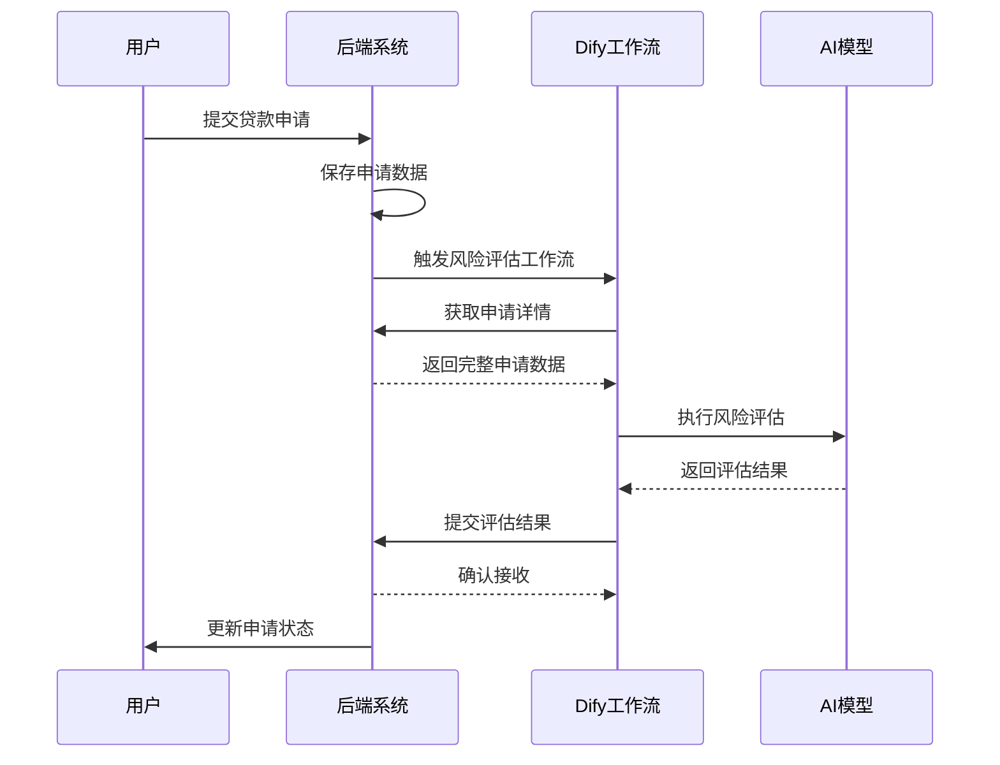

# Dify工作流集成 - API 接口文档

## 📋 模块概述

Dify工作流集成模块为AI风险评估系统提供后端数据支持。这些接口专门供Dify工作流调用，用于获取业务数据、提交AI分析结果等。

### 核心功能
-   **贷款数据查询**: 为AI风险评估提供贷款申请详情
-   **风险评估结果提交**: 接收AI分析结果并更新业务数据
-   **农机数据查询**: 为农机智能推荐提供数据支持
-   **征信查询**: 为AI风控提供用户征信信息

---

## 🔒 认证说明

**接口路径前缀**: `/api/internal/dify`
**认证方式**: Dify专用Token认证
**适用平台**: 内部系统 (仅限Dify工作流调用)

### 认证Header
```http
Authorization: Bearer {dify_api_token}
Content-Type: application/json
```

**说明**: 
- `dify_api_token` 为系统配置的Dify专用API Token
- 此Token与用户Token不同，专门用于内部服务间调用
- 不支持普通用户直接调用这些接口

---

## 💰 贷款相关接口

**接口路径前缀**: `/api/internal/dify/loan`

### 1.1 获取贷款申请详情 (供AI风险评估)

```http
POST /api/internal/dify/loan/get-application-details
Authorization: Bearer {dify_api_token}
Content-Type: application/json

{
    "application_id": "LA20240115001",
    "include_user_profile": true,
    "include_financial_data": true,
    "include_credit_history": true
}
```

**响应示例 (成功):**
```json
{
    "code": 200,
    "message": "获取成功",
    "data": {
        "application_info": {
            "application_id": "LA20240115001",
            "product_id": 1001,
            "product_name": "农业创业贷",
            "applied_amount": 100000,
            "applied_term": 12,
            "application_status": "under_review",
            "submitted_at": "2024-01-15T10:30:00Z",
            "purpose": "购买农机设备扩大种植规模",
            "collateral_info": {
                "type": "land_use_right",
                "value": 150000,
                "description": "农村土地使用权证"
            }
        },
        "user_profile": {
            "user_id": 1001,
            "real_name": "张三",
            "id_card": "370123199001011234", // 已脱敏
            "age": 34,
            "gender": "male",
            "education": "high_school",
            "marital_status": "married",
            "address": {
                "province": "山东省",
                "city": "济南市",
                "county": "历城区",
                "detail": "某某村123号"
            },
            "contact": {
                "phone": "138****8000",
                "email": "zhang***@example.com"
            },
            "registration_date": "2024-01-01T10:00:00Z",
            "verification_status": {
                "real_name_verified": true,
                "bank_card_verified": true,
                "address_verified": true
            }
        },
        "financial_data": {
            "annual_income": 80000,
            "income_sources": ["farming", "livestock"],
            "assets": {
                "land_area_mu": 50,
                "equipment_value": 80000,
                "livestock_value": 30000,
                "cash_deposits": 20000,
                "total_assets": 280000
            },
            "liabilities": {
                "existing_loans": 0,
                "credit_card_debt": 0,
                "other_debts": 0,
                "total_liabilities": 0
            },
            "debt_to_income_ratio": 0.0,
            "business_info": {
                "business_type": "individual_farming",
                "business_years": 8,
                "main_products": ["小麦", "玉米"],
                "seasonal_income_pattern": "stable"
            }
        },
        "credit_history": {
            "credit_score": 720,
            "credit_level": "good",
            "loan_history": [
                {
                    "loan_id": "previous_001",
                    "amount": 30000,
                    "status": "completed",
                    "repayment_record": "excellent",
                    "loan_date": "2022-03-15",
                    "completion_date": "2023-03-15"
                }
            ],
            "overdue_records": [],
            "credit_inquiries_6m": 2,
            "external_ratings": {
                "bank_rating": "A",
                "government_rating": "excellent_farmer"
            }
        },
        "risk_indicators": {
            "age_risk": "low",
            "income_stability": "high",
            "debt_burden": "very_low",
            "industry_risk": "medium",
            "regional_risk": "low",
            "collateral_adequacy": "good"
        },
        "additional_data": {
            "weather_impact_history": [],
            "market_price_volatility": "medium",
            "policy_support_available": true,
            "insurance_coverage": "comprehensive"
        }
    }
}
```

### 1.2 提交AI风险评估结果

```http
POST /api/internal/dify/loan/submit-assessment
Authorization: Bearer {dify_api_token}
Content-Type: application/json

{
    "application_id": "LA20240115001",
    "assessment_result": {
        "overall_risk_score": 85,
        "risk_level": "low",
        "recommendation": "approve",
        "recommended_amount": 100000,
        "recommended_term": 12,
        "recommended_interest_rate": 0.065,
        "confidence_score": 0.92
    },
    "detailed_analysis": {
        "credit_risk_score": 88,
        "financial_stability_score": 82,
        "business_viability_score": 85,
        "collateral_coverage_score": 90,
        "market_risk_score": 78
    },
    "risk_factors": [
        {
            "factor": "debt_to_income_ratio",
            "value": 0.0,
            "impact": "positive",
            "weight": 0.25
        },
        {
            "factor": "credit_history",
            "value": "excellent",
            "impact": "positive",
            "weight": 0.30
        },
        {
            "factor": "collateral_value",
            "value": 150000,
            "impact": "positive",
            "weight": 0.20
        }
    ],
    "ai_insights": {
        "key_strengths": [
            "无债务负担，财务状况良好",
            "信用记录优秀，历史还款表现良好",
            "抵押物价值充足，覆盖比例150%"
        ],
        "key_risks": [
            "农业行业受天气影响较大",
            "市场价格波动风险需要关注"
        ],
        "mitigation_suggestions": [
            "建议购买农业保险降低天气风险",
            "建立多元化种植结构分散市场风险"
        ]
    },
    "model_metadata": {
        "model_version": "v2.1.0",
        "assessment_time": "2024-01-15T14:30:00Z",
        "processing_duration_ms": 1250,
        "data_completeness": 0.95
    }
}
```

**响应示例 (成功):**
```json
{
    "code": 200,
    "message": "AI评估结果已记录",
    "data": {
        "application_id": "LA20240115001",
        "assessment_id": "ai_assess_20240115_001",
        "received_at": "2024-01-15T14:30:15Z",
        "next_step": "human_review",
        "estimated_review_time": "2024-01-16T10:00:00Z",
        "auto_approval_eligible": false,
        "manual_review_required": true,
        "review_priority": "normal"
    }
}
```

---

## 🚜 农机相关接口

**接口路径前缀**: `/api/internal/dify/machine`

### 2.1 获取农机租赁详情 (供智能推荐)

```http
POST /api/internal/dify/machine/get-rental-details
Authorization: Bearer {dify_api_token}
Content-Type: application/json

{
    "rental_id": "MR20240115001",
    "user_id": 1001,
    "include_user_preferences": true,
    "include_historical_rentals": true,
    "include_seasonal_patterns": true
}
```

**响应示例 (成功):**
```json
{
    "code": 200,
    "message": "获取成功",
    "data": {
        "rental_info": {
            "rental_id": "MR20240115001",
            "user_id": 1001,
            "machine_type": "harvester",
            "required_date": "2024-03-15",
            "duration_days": 5,
            "area_to_cover": 50,
            "crop_type": "wheat",
            "urgency_level": "medium"
        },
        "user_profile": {
            "farm_location": {
                "province": "山东省",
                "city": "济南市",
                "coordinates": [117.12, 36.65]
            },
            "farm_size_mu": 50,
            "main_crops": ["wheat", "corn"],
            "farming_experience_years": 8,
            "machinery_ownership": ["tractor_small", "irrigation_equipment"]
        },
        "historical_rentals": [
            {
                "rental_date": "2023-10-15",
                "machine_type": "harvester",
                "rating": 5,
                "efficiency_score": 0.92,
                "cost_satisfaction": 0.88
            },
            {
                "rental_date": "2023-06-20",
                "machine_type": "planter",
                "rating": 4,
                "efficiency_score": 0.85,
                "cost_satisfaction": 0.90
            }
        ],
        "seasonal_patterns": {
            "spring": ["planter", "fertilizer_spreader"],
            "summer": ["irrigation_equipment", "pest_control"],
            "autumn": ["harvester", "grain_dryer"],
            "winter": ["soil_preparation", "maintenance_tools"]
        },
        "available_machines": [
            {
                "machine_id": 501,
                "type": "harvester",
                "model": "约翰迪尔S680",
                "location_distance_km": 15,
                "daily_rate": 800,
                "availability_score": 0.95,
                "efficiency_rating": 4.8
            }
        ],
        "market_conditions": {
            "demand_level": "high",
            "peak_season": true,
            "price_trend": "stable",
            "weather_forecast": "favorable"
        }
    }
}
```

---

## 🔍 征信查询接口

**接口路径前缀**: `/api/internal/dify/credit`

### 3.1 征信信息查询

```http
POST /api/internal/dify/credit/query
Authorization: Bearer {dify_api_token}
Content-Type: application/json

{
    "user_id": 1001,
    "query_type": "comprehensive", // basic, comprehensive, risk_assessment
    "purpose": "loan_application",
    "application_id": "LA20240115001"
}
```

**响应示例 (成功):**
```json
{
    "code": 200,
    "message": "查询成功",
    "data": {
        "user_id": 1001,
        "query_id": "credit_query_20240115_001",
        "query_time": "2024-01-15T15:00:00Z",
        "credit_summary": {
            "credit_score": 720,
            "credit_level": "good",
            "score_range": "680-750",
            "last_updated": "2024-01-10T00:00:00Z"
        },
        "identity_verification": {
            "real_name_status": "verified",
            "id_card_status": "verified",
            "phone_status": "verified",
            "address_status": "verified",
            "verification_date": "2024-01-02T14:20:00Z"
        },
        "loan_history": {
            "total_loans": 2,
            "completed_loans": 1,
            "current_loans": 0,
            "overdue_times": 0,
            "max_overdue_days": 0,
            "total_borrowed": 30000,
            "total_repaid": 30000,
            "repayment_rate": 1.0
        },
        "credit_inquiries": {
            "last_6_months": 2,
            "last_12_months": 3,
            "recent_inquiries": [
                {
                    "date": "2024-01-15T10:30:00Z",
                    "institution": "数字惠农",
                    "purpose": "loan_application"
                }
            ]
        },
        "risk_indicators": {
            "debt_to_income_ratio": 0.0,
            "payment_behavior": "excellent",
            "stability_score": 0.92,
            "fraud_risk": "very_low",
            "default_probability": 0.03
        },
        "external_ratings": {
            "bank_internal_rating": "A",
            "government_credit_rating": "AAA",
            "industry_peer_ranking": "top_20_percent"
        },
        "additional_info": {
            "social_security_status": "active",
            "tax_payment_status": "compliant",
            "legal_disputes": [],
            "business_registration": {
                "type": "individual_farmer",
                "registration_date": "2016-03-01",
                "status": "active"
            }
        }
    }
}
```

---

## 🔧 错误码说明

| 错误码 | 说明 | 处理建议 |
|-------|------|---------|
| 8001 | Dify Token无效 | 检查Token配置 |
| 8002 | 申请ID不存在 | 确认申请ID正确性 |
| 8003 | 用户数据不完整 | 提示用户完善信息 |
| 8004 | AI评估结果格式错误 | 检查数据格式 |
| 8005 | 征信查询权限不足 | 确认查询权限 |
| 8006 | 外部服务调用失败 | 重试或联系技术支持 |
| 8007 | 数据处理超时 | 稍后重试 |
| 8008 | 农机信息不存在 | 检查农机ID |
| 8009 | 评估模型版本不匹配 | 更新模型版本 |
| 8010 | 请求频率过高 | 降低请求频率 |

---

## 📝 集成说明

### Dify工作流配置示例

```yaml
# dify-workflow.yml
name: "贷款风险评估工作流"
version: "2.1.0"
description: "AI驱动的贷款申请风险评估"

triggers:
  - type: "webhook"
    endpoint: "/webhook/loan-assessment"
    
steps:
  - name: "获取申请数据"
    type: "http_request"
    config:
      url: "${BACKEND_URL}/api/internal/dify/loan/get-application-details"
      method: "POST"
      headers:
        Authorization: "Bearer ${DIFY_API_TOKEN}"
      body:
        application_id: "${workflow.input.application_id}"
        include_user_profile: true
        include_financial_data: true
        include_credit_history: true
        
  - name: "风险评估模型"
    type: "ai_model"
    config:
      model: "risk-assessment-v2.1"
      input_data: "${steps.获取申请数据.output}"
      
  - name: "提交评估结果"
    type: "http_request"
    config:
      url: "${BACKEND_URL}/api/internal/dify/loan/submit-assessment"
      method: "POST"
      headers:
        Authorization: "Bearer ${DIFY_API_TOKEN}"
      body:
        application_id: "${workflow.input.application_id}"
        assessment_result: "${steps.风险评估模型.output}"
```

### 调用时序图



### 数据安全注意事项

1. **Token管理**: Dify API Token需要定期轮换，确保安全性
2. **数据脱敏**: 敏感信息（如身份证号、手机号）需要适当脱敏
3. **访问控制**: 仅限内部网络访问，外部无法直接调用
4. **日志记录**: 记录所有API调用，便于审计和排查
5. **错误处理**: 优雅处理异常情况，避免敏感信息泄露
6. **数据加密**: 传输过程中使用HTTPS加密

### 性能优化建议

1. **缓存策略**: 对频繁查询的数据进行缓存
2. **异步处理**: 耗时操作采用异步处理方式
3. **批量查询**: 支持批量获取数据减少网络开销
4. **超时控制**: 设置合理的超时时间
5. **重试机制**: 实现指数退避重试策略
6. **监控告警**: 监控API调用成功率和响应时间 