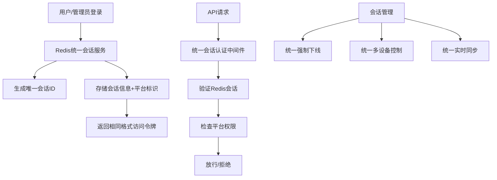

# 数字惠农金融系统 - 后端工程化文档

## 📋 项目概述

数字惠农后端采用现代化的微服务架构设计，基于Go语言和Gin框架构建，实现高性能、高并发的RESTful API服务。系统支持多平台（APP、Web、OA后台）的业务需求，提供完整的用户管理、贷款服务、农机管理、内容管理等核心功能。

**🔥 重要更新**: 系统已完全统一为Redis分布式会话认证架构，实现多后端实例的会话共享和实时控制。

## 🏗️ 系统架构

### 分层架构设计
```
┌─────────────────────────────────────────┐
│                客户端层                   │
├─────────────────────────────────────────┤
│     APP端      │   Web端   │  OA后台    │
└─────────────────────────────────────────┘
                    │
┌─────────────────────────────────────────┐
│                路由层                     │
├─────────────────────────────────────────┤
│        统一Redis会话认证中间件             │
│    （除Dify平台保持专用Token认证）          │
└─────────────────────────────────────────┘
                    │
┌─────────────────────────────────────────┐
│               控制器层                    │
├─────────────────────────────────────────┤
│   用户控制器  │ 贷款控制器 │ 农机控制器    │
└─────────────────────────────────────────┘
                    │
┌─────────────────────────────────────────┐
│               服务层                      │
├─────────────────────────────────────────┤
│  业务逻辑服务 │ Redis统一会话服务 │ AI服务   │
└─────────────────────────────────────────┘
                    │
┌─────────────────────────────────────────┐
│              数据访问层                   │
├─────────────────────────────────────────┤
│   MySQL数据库  │  Redis缓存  │  文件存储  │
└─────────────────────────────────────────┘
```

### 🔐 认证架构统一

#### 认证策略分布
- **Redis统一会话认证**: 所有用户、管理员、OA后台API使用同一套会话系统
- **Dify专用认证**: 仅用于 `/api/internal/dify/*` 工作流接口
- **无需认证**: 公开API、健康检查、认证相关接口

#### 统一会话管理流程


#### 权限控制简化
- **基础认证**: 验证用户是否登录
- **平台区分**: 通过platform字段区分不同平台(app/web/oa)
- **路由隔离**: 通过路由分组实现功能隔离，而非复杂权限验证

## 📁 目录结构

```
backend/
├── cmd/
│   └── server/
│       └── main.go                    # 主程序入口
├── configs/
│   └── config.yaml                    # 配置文件
├── internal/
│   ├── cache/                         # Redis缓存层
│   │   └── redis.go                   # Redis客户端和Pub/Sub
│   ├── config/
│   │   └── config.go                  # 配置管理
│   ├── database/
│   │   └── mysql.go                   # 数据库连接和迁移
│   ├── handler/                       # HTTP处理器层
│   │   ├── user_handler.go            # 用户相关处理器
│   │   ├── loan_handler.go            # 贷款相关处理器
│   │   ├── machine_handler.go         # 农机相关处理器
│   │   └── ...
│   ├── middleware/                    # 中间件层
│   │   ├── session_auth.go            # ✨ Redis会话认证中间件
│   │   ├── recovery.go                # 错误恢复中间件
│   │   ├── request_logger.go          # 请求日志中间件
│   │   ├── cors.go                    # 跨域处理中间件
│   │   └── dify_auth.go               # Dify专用认证中间件
│   ├── model/                         # 数据模型层
│   │   ├── user.go                    # 用户模型（含会话）
│   │   ├── loan.go                    # 贷款模型
│   │   ├── machine.go                 # 农机模型
│   │   └── ...
│   ├── repository/                    # 数据访问层
│   │   ├── user_repository.go         # 用户数据访问
│   │   ├── session_repository.go      # ✨ 会话数据访问
│   │   ├── loan_repository.go         # 贷款数据访问
│   │   └── ...
│   ├── router/
│   │   └── router.go                  # ✨ 统一Redis认证路由
│   ├── service/                       # 业务逻辑层
│   │   ├── user_service.go            # 用户业务逻辑
│   │   ├── session_service.go         # ✨ Redis会话服务
│   │   ├── loan_service.go            # 贷款业务逻辑
│   │   └── ...
│   └── utils/                         # 工具类
│       ├── jwt.go                     # JWT工具（会话系统使用）
│       ├── response.go                # 响应封装
│       └── validator.go               # 数据验证
├── uploads/                           # 文件上传目录
└── bin/                               # 可执行文件目录
```

## 🔧 核心技术栈

### 后端框架
- **Go 1.19+**: 高性能编程语言
- **Gin**: 轻量级Web框架
- **GORM**: ORM数据库操作
- **Redis**: 分布式会话存储和缓存
- **MySQL**: 主数据库
- **Swagger**: API文档生成

### 中间件技术
- **Redis会话认证**: 统一的分布式认证系统
- **CORS处理**: 跨域资源共享
- **请求日志**: 完整的请求追踪
- **错误恢复**: 优雅的错误处理
- **限流控制**: API请求频率限制

### 第三方集成
- **Dify AI**: 智能风险评估和决策支持
- **短信服务**: 用户验证和通知
- **文件存储**: 多媒体文件管理
- **支付网关**: 在线支付处理

## 🎯 核心功能模块

### 1. Redis统一会话管理系统 ✨
- **统一架构**: 所有平台（APP、Web、OA）使用同一套会话系统
- **同一连接**: 共享Redis连接池，无需分别创建管理员和用户连接
- **平台区分**: 通过platform字段区分不同平台，不改变底层存储结构
- **简化权限**: 基于路由分组和platform字段实现权限隔离，无复杂角色系统

### 2. 用户管理系统
- 用户注册、登录、认证
- 实名认证、银行卡绑定
- 用户标签和分类管理
- 用户行为分析

### 3. 贷款管理系统
- 贷款产品展示和申请
- AI智能风险评估
- 审批流程管理
- 放款和还款跟踪

### 4. 农机管理系统
- 农机注册和认证
- 租赁服务匹配
- 订单管理和评价
- 使用效率分析

### 5. 内容管理系统
- 农业资讯发布
- 专家咨询服务
- 分类标签管理
- 内容推荐算法

### 6. 系统管理
- 配置参数管理
- 系统监控和告警
- 日志分析和查询
- 性能优化调试

## 🔐 安全设计

### Redis会话安全
```yaml
安全机制:
  token_hashing: "SHA-256哈希存储"
  device_binding: "设备指纹绑定"
  ip_validation: "可选IP地址验证"
  session_limit: "单用户最大会话数控制"
  auto_cleanup: "过期会话自动清理"
  force_logout: "管理员强制下线"
```

### 数据安全
- **输入验证**: 严格的参数验证和过滤
- **SQL注入防护**: 使用GORM参数化查询
- **XSS防护**: 输出内容转义和过滤
- **CSRF防护**: 请求令牌验证

### 传输安全
- **HTTPS**: 强制使用SSL/TLS加密
- **Token机制**: 无状态身份验证
- **权限控制**: 基于角色的访问控制
- **API限流**: 防止接口滥用

## 🚀 性能优化

### Redis缓存策略
```go
统一缓存架构:
  会话存储: "sessions:{user_id}" (SET) - 用户所有平台会话
  会话详情: "session:{session_id}" (HASH) - 包含platform字段
  Token映射: "token:access:{hash}" (STRING) - 统一Token映射
  活跃排行: "sessions:active" (ZSET) - 所有平台活跃会话
  事件通知: "session:events" (PUB/SUB) - 统一事件通知
  平台统计: "platform:stats:{platform}" (HASH) - 各平台统计
```

### 数据库优化
- **连接池**: 数据库连接复用
- **索引策略**: 关键字段索引优化
- **分页查询**: 大数据集分页处理
- **读写分离**: 主从数据库架构

### 并发处理
- **Goroutine**: 轻量级并发处理
- **Channel**: 安全的数据传递
- **Context**: 请求上下文管理
- **超时控制**: 请求处理时间限制

## 📊 监控和日志

### 应用监控
- **健康检查**: `/health` 端点状态监控
- **性能指标**: 响应时间、吞吐量统计
- **错误追踪**: 异常日志记录和告警
- **资源使用**: CPU、内存、网络监控

### 会话监控
- **活跃会话**: 实时在线用户统计
- **会话分布**: 多平台会话分析
- **异常检测**: 可疑登录行为监控
- **性能分析**: Redis操作延迟统计

### 日志管理
```yaml
日志分类:
  access_log: "HTTP请求访问日志"
  error_log: "系统错误和异常日志"
  session_log: "会话操作审计日志"
  business_log: "业务操作记录日志"
```

## 🔨 开发规范

### 代码规范
- **Go标准**: 遵循Go官方编码规范
- **命名约定**: 清晰的函数和变量命名
- **注释文档**: 完整的代码注释
- **错误处理**: 统一的错误处理机制

### API设计规范
- **RESTful**: 标准的REST API设计
- **HTTP状态码**: 正确的状态码使用
- **统一响应**: 标准化的响应格式
- **版本控制**: API版本管理策略

### 测试规范
- **单元测试**: 核心函数单元测试
- **集成测试**: 完整流程集成测试
- **性能测试**: 高并发压力测试
- **安全测试**: 漏洞扫描和渗透测试

## 🚀 部署架构

### 容器化部署
```yaml
Docker容器:
  - huinong-backend: "主服务容器"
  - redis: "Redis缓存容器"
  - mysql: "MySQL数据库容器"
  - nginx: "反向代理容器"
```

### Kubernetes部署
```yaml
K8s资源:
  Deployment: "应用部署管理"
  Service: "服务发现和负载均衡"
  ConfigMap: "配置文件管理"
  Secret: "敏感信息管理"
  Ingress: "外部访问入口"
```

### 环境管理
- **开发环境**: 本地开发和调试
- **测试环境**: 功能测试和集成测试
- **预生产环境**: 性能测试和压力测试
- **生产环境**: 正式服务运行

## 📈 扩展性设计

### 微服务架构准备
- **服务拆分**: 按业务域拆分服务
- **API网关**: 统一入口和路由
- **服务发现**: 动态服务注册和发现
- **配置中心**: 集中化配置管理

### 分布式架构
- **分布式会话**: Redis集群会话共享
- **分布式锁**: Redis实现分布式锁
- **消息队列**: 异步任务处理
- **分布式事务**: 数据一致性保证

### 高可用设计
- **负载均衡**: 多实例负载分担
- **故障转移**: 自动故障检测和切换
- **数据备份**: 定期数据备份和恢复
- **监控告警**: 实时故障监控和通知

## 🔄 持续集成/持续部署

### CI/CD流程
```yaml
持续集成:
  代码提交: "Git代码仓库"
  自动构建: "Go编译和打包"
  自动测试: "单元测试和集成测试"
  代码质量: "静态代码分析"
  镜像构建: "Docker镜像构建"

持续部署:
  环境部署: "自动部署到测试环境"
  验收测试: "自动化验收测试"
  生产部署: "蓝绿部署或滚动更新"
  健康检查: "部署后健康检查"
  回滚机制: "快速回滚到稳定版本"
```

## 📚 文档体系

### 技术文档
- **架构文档**: 系统整体架构设计
- **API文档**: 接口定义和使用说明
- **数据库文档**: 数据模型和关系设计
- **部署文档**: 环境搭建和部署指南

### 开发文档
- **开发指南**: 开发环境搭建和规范
- **代码文档**: 核心模块代码说明
- **测试文档**: 测试用例和测试报告
- **运维文档**: 监控、日志和故障处理

通过这种统一的Redis会话认证架构和完善的工程化体系，数字惠农后端实现了高性能、高可用、高安全的分布式服务！ 🎉

## 📝 版本更新记录

### v2.0.0 - Redis会话架构统一 (2024-01-15)
**🔥 重大架构升级**
- ✨ **统一认证架构**: 除Dify平台外，所有路由统一使用Redis会话认证
- 🚀 **统一连接池**: 用户和管理员共享同一Redis连接，简化架构
- 🔒 **权限简化**: 移除复杂角色系统，基于platform字段和路由分组实现权限控制
- 📊 **统一监控**: 所有平台会话使用相同的监控和管理机制
- 🛡️ **架构优化**: 减少冗余代码，提升系统性能和维护性

**技术变更**:
- 统一会话服务，移除管理员专用认证逻辑
- 简化中间件，使用platform字段区分平台权限
- 保留Dify平台专用Token认证：`/api/internal/dify/*`
- 优化Redis键结构，支持多平台统一管理
- 简化权限验证逻辑，提升性能

**影响范围**:
- 所有用户API：`/api/user/*` - Redis统一会话认证
- 管理员API：`/api/admin/*` - Redis统一会话认证 + 平台验证
- OA后台API：`/api/oa/*` - Redis统一会话认证 + 平台验证
- 公共内容：`/api/content/*` - Redis可选认证（登录用户可获得更多功能）
- Dify工作流：`/api/internal/dify/*` - 保持专用Token认证

### v1.5.0 - 会话管理系统实现 (2024-01-14)
- 🎯 实现完整的Redis会话管理服务
- 📝 创建会话相关数据模型和存储结构
- 🔧 开发会话认证中间件和工具函数
- 📋 完善API接口文档和使用指南

### v1.0.0 - 基础架构建立 (2024-01-01)
- 🏗️ 建立基础的微服务架构
- 🔐 实现基础JWT认证系统
- 📚 创建核心业务模块
- 🛠️ 建立开发和部署流程