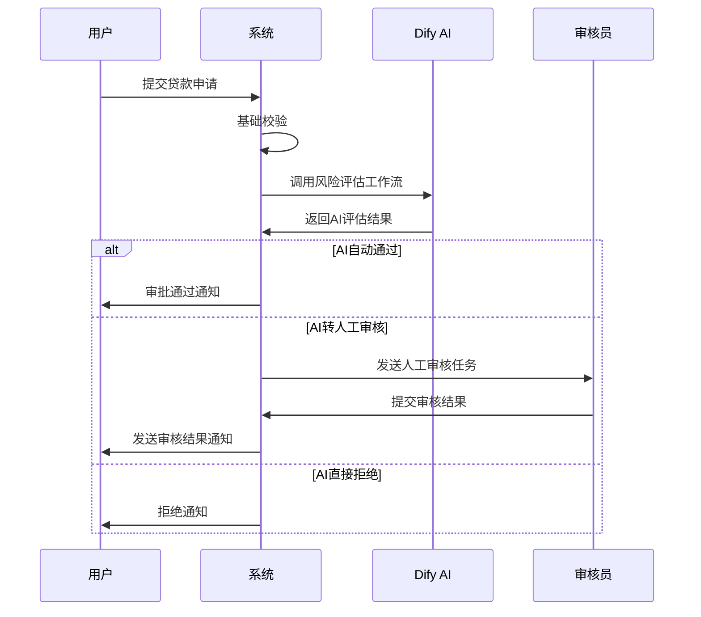

# 贷款业务模块 - 数据模型设计文档

## 1. 模块概述

贷款业务模块是数字惠农系统的核心功能模块，负责贷款产品管理、贷款申请处理、AI智能审批、风险评估等功能。该模块与Dify AI平台深度集成，实现自动化审批流程。

### 主要功能特性
- 🏦 **多样化贷款产品**: 支持农资贷、农机贷、经营贷、种植贷等多种产品类型
- 🤖 **AI智能审批**: 集成Dify工作流，实现自动化风险评估和审批决策
- 📊 **风险控制**: 多维度风险评估，支持自动和人工双重审核
- 📋 **全流程管理**: 从申请提交到放款完成的全生命周期管理
- 📈 **实时监控**: 完整的审批日志和工作流调用记录

## 2. 核心数据模型

### 2.1 loan_products - 贷款产品表

```go
type LoanProduct struct {
    ID              uint64    `gorm:"primaryKey;autoIncrement" json:"id"`
    ProductCode     string    `gorm:"type:varchar(20);uniqueIndex;not null" json:"product_code"`
    ProductName     string    `gorm:"type:varchar(100);not null" json:"product_name"`
    Description     string    `gorm:"type:text" json:"description"`
    
    // 产品类型：agricultural_material(农资贷)、machinery(农机贷)、operation(经营贷)、planting(种植贷)
    ProductType     string    `gorm:"type:varchar(30);not null" json:"product_type"`
    
    // 贷款额度
    MinAmount       int64     `gorm:"not null" json:"min_amount"`        // 最小额度(分)
    MaxAmount       int64     `gorm:"not null" json:"max_amount"`        // 最大额度(分)
    
    // 贷款期限
    MinTerm         int       `gorm:"not null" json:"min_term"`          // 最小期限(天)
    MaxTerm         int       `gorm:"not null" json:"max_term"`          // 最大期限(天)
    
    // 利率信息
    InterestRate    float64   `gorm:"type:decimal(8,4);not null" json:"interest_rate"`  // 年化利率
    InterestType    string    `gorm:"type:varchar(20);not null;default:'fixed'" json:"interest_type"` // fixed(固定)、floating(浮动)
    
    // 还款方式：equal_installment(等额本息)、equal_principal(等额本金)、bullet(到期还本)
    RepaymentMethod string    `gorm:"type:varchar(30);not null" json:"repayment_method"`
    
    // 申请条件(JSON格式)
    EligibilityCriteria string `gorm:"type:json" json:"eligibility_criteria"`
    
    // 所需材料(JSON格式)
    RequiredDocuments string  `gorm:"type:json" json:"required_documents"`
    
    // 产品状态：active(上线)、inactive(下线)、testing(测试)
    Status          string    `gorm:"type:varchar(20);not null;default:'active'" json:"status"`
    
    // 适用用户类型(JSON数组)
    ApplicableUserTypes string `gorm:"type:json" json:"applicable_user_types"`
    
    // 合作机构
    PartnerName     string    `gorm:"type:varchar(100)" json:"partner_name"`
    PartnerCode     string    `gorm:"type:varchar(50)" json:"partner_code"`
    
    // 风控参数
    RiskLevel       string    `gorm:"type:varchar(20);default:'medium'" json:"risk_level"` // low, medium, high
    AutoApprovalEnabled bool  `gorm:"default:true" json:"auto_approval_enabled"`
    
    // 显示排序
    SortOrder       int       `gorm:"default:0" json:"sort_order"`
    IsActive        bool      `gorm:"default:true" json:"is_active"`
    
    CreatedAt       time.Time `json:"created_at"`
    UpdatedAt       time.Time `json:"updated_at"`
    DeletedAt       gorm.DeletedAt `gorm:"index" json:"-"`
}
```

### 2.2 loan_applications - 贷款申请表

```go
type LoanApplication struct {
    ID              uint64    `gorm:"primaryKey;autoIncrement" json:"id"`
    ApplicationNo   string    `gorm:"type:varchar(30);uniqueIndex;not null" json:"application_no"`
    UserID          uint64    `gorm:"not null;index" json:"user_id"`
    ProductID       uint64    `gorm:"not null;index" json:"product_id"`
    
    // 申请信息
    AppliedAmount   int64     `gorm:"not null" json:"applied_amount"`    // 申请金额(分)
    AppliedTerm     int       `gorm:"not null" json:"applied_term"`      // 申请期限(天)
    Purpose         string    `gorm:"type:varchar(200);not null" json:"purpose"` // 资金用途
    
    // 申请人信息(JSON格式，冗余存储便于审批)
    ApplicantInfo   string    `gorm:"type:json" json:"applicant_info"`
    
    // 上传材料(JSON格式)
    UploadedDocuments string  `gorm:"type:json" json:"uploaded_documents"`
    
    // 申请状态：pending_ai(待AI审批)、ai_processing(AI审批中)、pending_manual(待人工审核)、
    // manual_processing(人工审核中)、approved(已通过)、rejected(已拒绝)、cancelled(已取消)、
    // disbursed(已放款)、completed(已完成)
    Status          string    `gorm:"type:varchar(30);not null;default:'pending_ai'" json:"status"`
    
    // AI审批相关
    AIRiskLevel     string    `gorm:"type:varchar(20)" json:"ai_risk_level"`     // AI评估风险等级
    AIScore         float64   `gorm:"type:decimal(5,2)" json:"ai_score"`         // AI评分(0-100)
    AIDecision      string    `gorm:"type:varchar(20)" json:"ai_decision"`       // AI决策：approve、reject、manual
    AIComments      string    `gorm:"type:text" json:"ai_comments"`              // AI审批意见
    AIProcessedAt   *time.Time `json:"ai_processed_at"`
    
    // 风险评估结果(JSON格式)
    RiskAssessment  string    `gorm:"type:json" json:"risk_assessment"`
    
    // 人工审核相关
    ManualReviewerID *uint64  `json:"manual_reviewer_id"`
    ManualComments   string   `gorm:"type:text" json:"manual_comments"`
    ManualDecision   string   `gorm:"type:varchar(20)" json:"manual_decision"`
    ManualReviewedAt *time.Time `json:"manual_reviewed_at"`
    
    // 审批结果
    ApprovedAmount  *int64    `json:"approved_amount"`                           // 批准金额(分)
    ApprovedTerm    *int      `json:"approved_term"`                             // 批准期限(天)
    ApprovedRate    *float64  `gorm:"type:decimal(8,4)" json:"approved_rate"`    // 批准利率
    
    // 重要时间节点
    SubmittedAt     time.Time `json:"submitted_at"`
    ApprovedAt      *time.Time `json:"approved_at"`
    RejectedAt      *time.Time `json:"rejected_at"`
    DisbursedAt     *time.Time `json:"disbursed_at"`
    
    CreatedAt       time.Time `json:"created_at"`
    UpdatedAt       time.Time `json:"updated_at"`
    
    // 关联
    User            User            `gorm:"foreignKey:UserID" json:"user,omitempty"`
    Product         LoanProduct     `gorm:"foreignKey:ProductID" json:"product,omitempty"`
    ManualReviewer  *OAUser         `gorm:"foreignKey:ManualReviewerID" json:"manual_reviewer,omitempty"`
}
```

### 2.3 approval_logs - 审批日志表

```go
type ApprovalLog struct {
    ID              uint64    `gorm:"primaryKey;autoIncrement" json:"id"`
    ApplicationID   uint64    `gorm:"not null;index" json:"application_id"`
    
    // 审批类型：ai(AI审批)、manual(人工审批)、system(系统操作)
    ApprovalType    string    `gorm:"type:varchar(20);not null" json:"approval_type"`
    
    // 操作类型：submit(提交)、review(审核)、approve(通过)、reject(拒绝)、cancel(取消)
    ActionType      string    `gorm:"type:varchar(20);not null" json:"action_type"`
    
    // 操作人(AI审批时为空)
    OperatorID      *uint64   `json:"operator_id"`
    OperatorType    string    `gorm:"type:varchar(20)" json:"operator_type"` // user、oa_user、system、ai
    
    // 操作前状态
    StatusBefore    string    `gorm:"type:varchar(30)" json:"status_before"`
    
    // 操作后状态
    StatusAfter     string    `gorm:"type:varchar(30)" json:"status_after"`
    
    // 操作详情(JSON格式)
    ActionDetails   string    `gorm:"type:json" json:"action_details"`
    
    // 备注
    Comments        string    `gorm:"type:text" json:"comments"`
    
    // IP地址
    IPAddress       string    `gorm:"type:varchar(45)" json:"ip_address"`
    
    CreatedAt       time.Time `json:"created_at"`
    
    // 关联
    Application     LoanApplication `gorm:"foreignKey:ApplicationID" json:"application,omitempty"`
}
```

### 2.4 dify_workflow_logs - Dify工作流调用日志表

```go
type DifyWorkflowLog struct {
    ID              uint64    `gorm:"primaryKey;autoIncrement" json:"id"`
    ApplicationID   uint64    `gorm:"not null;index" json:"application_id"`
    
    // Dify相关信息
    WorkflowName    string    `gorm:"type:varchar(100);not null" json:"workflow_name"`
    WorkflowID      string    `gorm:"type:varchar(100)" json:"workflow_id"`
    RequestID       string    `gorm:"type:varchar(100);index" json:"request_id"`
    
    // 请求信息
    RequestMethod   string    `gorm:"type:varchar(10);not null" json:"request_method"` // POST、GET
    RequestURL      string    `gorm:"type:varchar(500)" json:"request_url"`
    RequestHeaders  string    `gorm:"type:json" json:"request_headers"`
    RequestPayload  string    `gorm:"type:json" json:"request_payload"`
    
    // 响应信息
    ResponseStatus  int       `json:"response_status"`                                   // HTTP状态码
    ResponseHeaders string    `gorm:"type:json" json:"response_headers"`
    ResponsePayload string    `gorm:"type:json" json:"response_payload"`
    
    // 执行信息
    ExecutionTime   int       `json:"execution_time"`                                    // 执行时间(毫秒)
    
    // 状态：pending(等待中)、processing(处理中)、success(成功)、failed(失败)、timeout(超时)
    Status          string    `gorm:"type:varchar(20);not null;default:'pending'" json:"status"`
    
    // 错误信息
    ErrorCode       string    `gorm:"type:varchar(50)" json:"error_code"`
    ErrorMessage    string    `gorm:"type:text" json:"error_message"`
    
    // 重试信息
    RetryCount      int       `gorm:"default:0" json:"retry_count"`
    MaxRetries      int       `gorm:"default:3" json:"max_retries"`
    NextRetryAt     *time.Time `json:"next_retry_at"`
    
    CreatedAt       time.Time `json:"created_at"`
    UpdatedAt       time.Time `json:"updated_at"`
    
    // 关联
    Application     LoanApplication `gorm:"foreignKey:ApplicationID" json:"application,omitempty"`
}
```

## 3. 数据库关系设计

### 3.1 实体关系图(ERD)

```
┌─────────────────┐    1:N    ┌─────────────────┐
│   LoanProduct   │◄─────────►│ LoanApplication │
└─────────────────┘           └─────────────────┘
                                       │
                                      1:N
                                       ▼
┌─────────────────┐           ┌─────────────────┐
│      User       │◄─────────►│  ApprovalLog    │
└─────────────────┘    1:N    └─────────────────┘
                                       │
                                      1:N
                                       ▼
┌─────────────────┐           ┌─────────────────┐
│     OAUser      │◄─────────►│DifyWorkflowLog  │
└─────────────────┘    1:N    └─────────────────┘
```

### 3.2 主要关联关系

1. **用户 ↔ 贷款申请**: 一个用户可以有多个贷款申请
2. **贷款产品 ↔ 贷款申请**: 一个产品可以对应多个申请
3. **贷款申请 ↔ 审批日志**: 一个申请有多条审批记录
4. **贷款申请 ↔ Dify日志**: 一个申请可能有多次AI工作流调用
5. **OA用户 ↔ 贷款申请**: OA用户作为人工审核员

## 4. 业务流程设计

### 4.1 贷款申请审批流程



### 4.2 状态流转图

```
[pending_ai] ──AI处理──→ [ai_processing]
      │                         │
      │                         ▼
      │              ┌─────[pending_manual]────┐
      │              │                         │
      │              ▼                         ▼
      │         [approved] ────放款───→ [disbursed] ──→ [completed]
      │              │                         
      │              │                         
      └──────────────┼─────────────────→ [rejected]
                     │
                     └─────────────────→ [cancelled]
```

### 4.3 AI工作流集成

```go
// Dify工作流调用示例
type DifyRequest struct {
    ApplicantInfo     map[string]interface{} `json:"applicant_info"`
    LoanDetails       map[string]interface{} `json:"loan_details"`
    HistoryData       map[string]interface{} `json:"history_data"`
    RiskParameters    map[string]interface{} `json:"risk_parameters"`
}

type DifyResponse struct {
    Decision         string  `json:"decision"`         // approve/reject/manual
    RiskLevel        string  `json:"risk_level"`       // low/medium/high
    Score            float64 `json:"score"`            // 0-100
    Comments         string  `json:"comments"`
    RecommendedAmount *int64 `json:"recommended_amount"`
    RecommendedTerm   *int   `json:"recommended_term"`
    RecommendedRate   *float64 `json:"recommended_rate"`
}
```

## 5. 服务层实现

### 5.1 LoanService接口定义

```go
type LoanService interface {
    // 产品管理
    GetProducts(ctx context.Context, req *GetProductsRequest) (*GetProductsResponse, error)
    GetProductDetail(ctx context.Context, productID uint64) (*LoanProduct, error)
    
    // 申请管理
    SubmitApplication(ctx context.Context, req *SubmitApplicationRequest) (*SubmitApplicationResponse, error)
    GetApplication(ctx context.Context, applicationID uint64) (*LoanApplication, error)
    GetUserApplications(ctx context.Context, userID uint64, req *GetUserApplicationsRequest) (*GetUserApplicationsResponse, error)
    
    // 审批管理
    ProcessAIApproval(ctx context.Context, applicationID uint64) error
    ProcessManualApproval(ctx context.Context, req *ProcessManualApprovalRequest) error
    
    // Dify集成
    CallDifyWorkflow(ctx context.Context, applicationID uint64, workflowName string) (*DifyResponse, error)
    RetryFailedWorkflows(ctx context.Context) error
}
```

### 5.2 核心业务逻辑

#### 申请提交逻辑
```go
func (s *loanService) SubmitApplication(ctx context.Context, req *SubmitApplicationRequest) (*SubmitApplicationResponse, error) {
    // 1. 参数验证
    if err := s.validateApplication(req); err != nil {
        return nil, err
    }
    
    // 2. 获取产品信息
    product, err := s.loanRepo.GetProductByID(ctx, req.ProductID)
    if err != nil {
        return nil, err
    }
    
    // 3. 检查用户资格
    if err := s.checkUserEligibility(ctx, req.UserID, product); err != nil {
        return nil, err
    }
    
    // 4. 生成申请编号
    applicationNo := s.generateApplicationNo()
    
    // 5. 创建申请记录
    application := &model.LoanApplication{
        ApplicationNo:   applicationNo,
        UserID:          req.UserID,
        ProductID:       req.ProductID,
        AppliedAmount:   req.Amount,
        AppliedTerm:     req.Term,
        Purpose:         req.Purpose,
        ApplicantInfo:   req.ApplicantInfo,
        UploadedDocuments: req.Documents,
        Status:          "pending_ai",
        SubmittedAt:     time.Now(),
    }
    
    if err := s.loanRepo.CreateApplication(ctx, application); err != nil {
        return nil, err
    }
    
    // 6. 记录审批日志
    s.logApprovalAction(ctx, application.ID, "submit", "system", "", "pending_ai")
    
    // 7. 异步触发AI审批
    go s.ProcessAIApproval(context.Background(), application.ID)
    
    return &SubmitApplicationResponse{
        ApplicationID: application.ID,
        ApplicationNo: applicationNo,
        Status:        "pending_ai",
    }, nil
}
```

#### AI审批处理逻辑
```go
func (s *loanService) ProcessAIApproval(ctx context.Context, applicationID uint64) error {
    // 1. 获取申请信息
    application, err := s.loanRepo.GetApplicationByID(ctx, applicationID)
    if err != nil {
        return err
    }
    
    // 2. 更新状态为处理中
    application.Status = "ai_processing"
    s.loanRepo.UpdateApplication(ctx, application)
    
    // 3. 调用Dify工作流
    response, err := s.CallDifyWorkflow(ctx, applicationID, "loan_risk_assessment")
    if err != nil {
        application.Status = "pending_manual"
        application.AIComments = "AI审批失败，转人工审核"
        s.loanRepo.UpdateApplication(ctx, application)
        return err
    }
    
    // 4. 更新AI审批结果
    application.AIRiskLevel = response.RiskLevel
    application.AIScore = response.Score
    application.AIDecision = response.Decision
    application.AIComments = response.Comments
    application.AIProcessedAt = &time.Time{}
    *application.AIProcessedAt = time.Now()
    
    // 5. 根据AI决策更新状态
    switch response.Decision {
    case "approve":
        application.Status = "approved"
        application.ApprovedAmount = response.RecommendedAmount
        application.ApprovedTerm = response.RecommendedTerm
        application.ApprovedRate = response.RecommendedRate
        application.ApprovedAt = &time.Time{}
        *application.ApprovedAt = time.Now()
    case "reject":
        application.Status = "rejected"
        application.RejectedAt = &time.Time{}
        *application.RejectedAt = time.Now()
    case "manual":
        application.Status = "pending_manual"
    }
    
    // 6. 保存更新
    s.loanRepo.UpdateApplication(ctx, application)
    
    // 7. 记录日志
    s.logApprovalAction(ctx, applicationID, "ai_process", "ai", "pending_ai", application.Status)
    
    return nil
}
```

## 6. Repository层实现

### 6.1 LoanRepository接口

```go
type LoanRepository interface {
    // 产品管理
    GetProductByID(ctx context.Context, id uint) (*model.LoanProduct, error)
    GetActiveProducts(ctx context.Context, userType string) ([]*model.LoanProduct, error)
    ListProducts(ctx context.Context, req *ListProductsRequest) (*ListProductsResponse, error)
    
    // 申请管理
    CreateApplication(ctx context.Context, application *model.LoanApplication) error
    GetApplicationByID(ctx context.Context, id uint) (*model.LoanApplication, error)
    GetApplicationByNo(ctx context.Context, applicationNo string) (*model.LoanApplication, error)
    UpdateApplication(ctx context.Context, application *model.LoanApplication) error
    GetUserApplications(ctx context.Context, userID uint, page, limit int, status string) ([]*model.LoanApplication, int64, error)
    
    // 审批日志
    CreateApprovalLog(ctx context.Context, log *model.ApprovalLog) error
    GetApprovalLogs(ctx context.Context, applicationID uint) ([]*model.ApprovalLog, error)
    
    // Dify日志
    CreateDifyLog(ctx context.Context, log *model.DifyWorkflowLog) error
    GetDifyLogs(ctx context.Context, applicationID uint) ([]*model.DifyWorkflowLog, error)
}
```

## 7. API接口设计

### 7.1 用户端接口

```
GET    /api/v1/loans/products              # 获取贷款产品列表
GET    /api/v1/loans/products/{id}         # 获取产品详情
POST   /api/v1/loans/applications          # 提交贷款申请
GET    /api/v1/loans/applications          # 获取我的申请列表
GET    /api/v1/loans/applications/{id}     # 获取申请详情
POST   /api/v1/loans/applications/{id}/cancel # 取消申请
```

### 7.2 管理端接口

```
GET    /api/v1/admin/loans/applications            # 获取申请列表
GET    /api/v1/admin/loans/applications/{id}       # 获取申请详情
POST   /api/v1/admin/loans/applications/{id}/approve # 审批通过
POST   /api/v1/admin/loans/applications/{id}/reject  # 审批拒绝
GET    /api/v1/admin/loans/applications/{id}/logs    # 获取审批日志
GET    /api/v1/admin/loans/statistics               # 获取统计数据
```

## 8. 技术实现要点

### 8.1 事务处理
- 申请提交和状态更新使用数据库事务确保一致性
- AI审批结果更新采用乐观锁防止并发问题

### 8.2 异步处理
- AI工作流调用采用异步处理，避免阻塞用户请求
- 失败的工作流调用支持自动重试机制

### 8.3 数据安全
- 敏感数据(如身份证号)进行加密存储
- API接口采用JWT认证和权限控制

### 8.4 监控告警
- 关键业务指标监控：申请成功率、审批时效等
- AI工作流调用失败自动告警

### 8.5 性能优化
- 数据库索引优化：申请状态、用户ID、产品ID等
- 缓存热点数据：产品信息、用户基本信息
- 分页查询优化：合理的默认页大小和最大限制

## 9. 扩展性设计

### 9.1 产品类型扩展
- 支持自定义产品类型和审批规则
- 产品配置支持JSON格式，便于扩展

### 9.2 工作流扩展
- 支持多个AI工作流串联调用
- 支持工作流版本管理和灰度发布

### 9.3 第三方集成
- 预留接口对接第三方征信系统
- 支持多家金融机构产品接入 