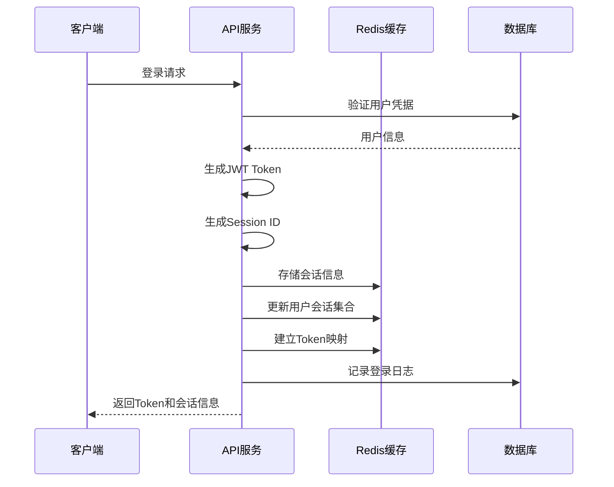
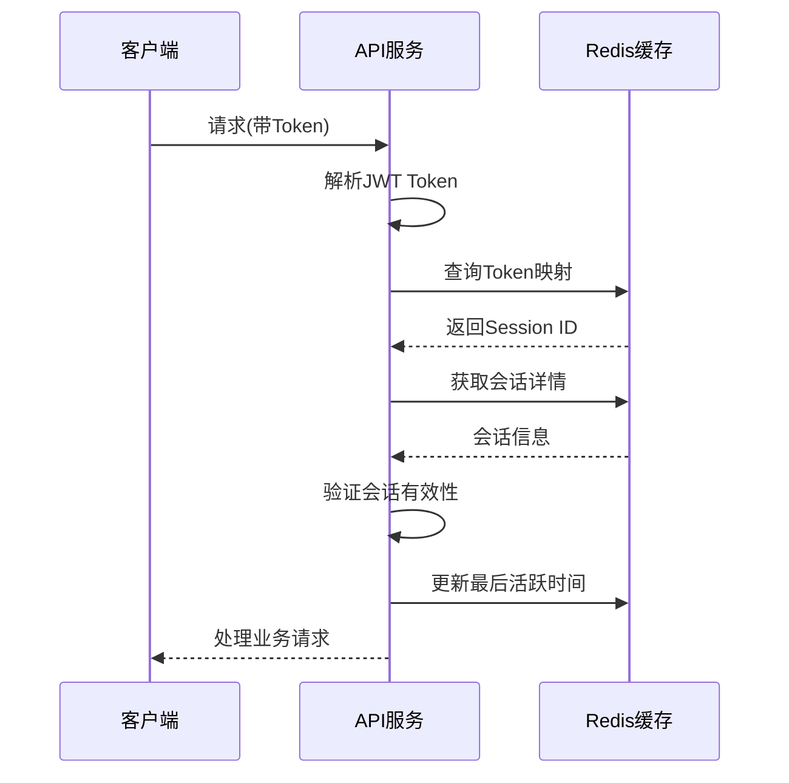

# 会话管理模块 - 数据模型设计文档

## 1. 模块概述

会话管理模块是数字惠农系统中负责用户认证状态维护、多端登录控制、分布式会话保持的核心模块。基于Redis缓存实现高性能的会话管理，支持多后端实例的会话同步和共享。

### 主要功能特性
- 🔐 **分布式会话**: 基于Redis的分布式会话存储和管理
- 🌐 **多后端支持**: 支持多个后端实例共享用户会话状态
- 📱 **多端登录**: 支持用户在不同设备、平台同时登录
- ⚡ **高性能缓存**: Redis缓存优化，毫秒级会话验证
- 🔄 **会话同步**: 实时会话状态同步和更新
- 🔒 **安全机制**: Token刷新、会话过期、强制下线等安全特性

## 2. Redis会话数据结构设计

### 2.1 会话存储模式

#### 2.1.1 用户会话集合 (SET)
```redis
# 存储用户的所有活跃会话ID
Key: user:sessions:{user_id}
Type: SET
TTL: 7天
Value: [session_id1, session_id2, ...]

# 示例
user:sessions:1001 = {
    "sess_abc123def456",
    "sess_xyz789uvw012"
}
```

#### 2.1.2 会话详情 (HASH)
```redis
# 存储单个会话的详细信息
Key: session:{session_id}
Type: HASH
TTL: 24小时 (可配置)
Fields:
- user_id: 用户ID
- platform: 平台类型
- device_id: 设备ID
- device_type: 设备类型
- ip_address: IP地址
- user_agent: 用户代理
- access_token: 访问令牌
- refresh_token: 刷新令牌
- created_at: 创建时间
- last_active_at: 最后活跃时间
- expires_at: 过期时间
- status: 会话状态

# 示例
session:sess_abc123def456 = {
    "user_id": "1001",
    "platform": "app",
    "device_id": "iPhone_12_ABC123",
    "device_type": "ios",
    "ip_address": "192.168.1.100",
    "access_token": "eyJhbGci...",
    "refresh_token": "eyJhbGci...",
    "created_at": "2024-01-15T10:30:00Z",
    "last_active_at": "2024-01-15T14:25:30Z",
    "expires_at": "2024-01-16T10:30:00Z",
    "status": "active"
}
```

#### 2.1.3 Token映射 (STRING)
```redis
# Access Token到Session ID的映射
Key: token:access:{token_hash}
Type: STRING
TTL: 24小时
Value: session_id

# Refresh Token到Session ID的映射
Key: token:refresh:{token_hash}
Type: STRING
TTL: 7天
Value: session_id

# 示例
token:access:sha256_of_access_token = "sess_abc123def456"
token:refresh:sha256_of_refresh_token = "sess_abc123def456"
```

#### 2.1.4 设备会话映射 (STRING)
```redis
# 设备到会话的映射（用于单设备登录控制）
Key: device:session:{user_id}:{device_id}
Type: STRING
TTL: 7天
Value: session_id

# 示例
device:session:1001:iPhone_12_ABC123 = "sess_abc123def456"
```

#### 2.1.5 会话统计 (ZSET)
```redis
# 活跃会话排行（按最后活跃时间排序）
Key: sessions:active
Type: ZSET
TTL: 永久
Score: last_active_timestamp
Member: session_id

# 示例
sessions:active = {
    1705334730: "sess_abc123def456",
    1705334725: "sess_xyz789uvw012"
}
```

### 2.2 会话生命周期管理

#### 2.2.1 会话创建流程


#### 2.2.2 会话验证流程


## 3. 数据库模型设计

### 3.1 user_sessions - 会话持久化表

```go
type UserSession struct {
    ID              uint64     `gorm:"primaryKey;autoIncrement" json:"id"`
    UserID          uint64     `gorm:"not null;index:idx_user_sessions_user_id" json:"user_id"`
    SessionID       string     `gorm:"type:varchar(64);uniqueIndex;not null" json:"session_id"`
    
    // 平台和设备信息
    Platform        string     `gorm:"type:varchar(20);not null;index:idx_user_sessions_platform" json:"platform"`
    DeviceID        string     `gorm:"type:varchar(128);index:idx_user_sessions_device" json:"device_id"`
    DeviceType      string     `gorm:"type:varchar(20)" json:"device_type"`
    DeviceName      string     `gorm:"type:varchar(100)" json:"device_name"`
    AppVersion      string     `gorm:"type:varchar(20)" json:"app_version"`
    UserAgent       string     `gorm:"type:text" json:"user_agent"`
    
    // 网络信息
    IPAddress       string     `gorm:"type:varchar(45);index:idx_user_sessions_ip" json:"ip_address"`
    Location        string     `gorm:"type:varchar(200)" json:"location"`
    ISP             string     `gorm:"type:varchar(50)" json:"isp"`
    
    // Token信息（加密存储）
    AccessTokenHash string     `gorm:"type:varchar(64);index:idx_user_sessions_access_token" json:"-"`
    RefreshTokenHash string    `gorm:"type:varchar(64);index:idx_user_sessions_refresh_token" json:"-"`
    TokenExpiresAt  time.Time  `json:"token_expires_at"`
    RefreshExpiresAt time.Time `json:"refresh_expires_at"`
    
    // 会话状态和生命周期
    Status          string     `gorm:"type:varchar(20);not null;default:'active';index:idx_user_sessions_status" json:"status"`
    LoginTime       time.Time  `json:"login_time"`
    LastActiveAt    time.Time  `gorm:"index:idx_user_sessions_last_active" json:"last_active_at"`
    LogoutTime      *time.Time `json:"logout_time"`
    
    // 安全信息
    LoginMethod     string     `gorm:"type:varchar(20)" json:"login_method"` // password, sms, oauth
    RiskScore       int        `gorm:"default:0" json:"risk_score"`          // 风险评分
    TrustLevel      string     `gorm:"type:varchar(20);default:'normal'" json:"trust_level"` // high, normal, low
    
    // 业务统计
    RequestCount    uint64     `gorm:"default:0" json:"request_count"`
    LastRequestAt   *time.Time `json:"last_request_at"`
    
    CreatedAt       time.Time  `json:"created_at"`
    UpdatedAt       time.Time  `json:"updated_at"`
    
    // 关联
    User            User       `gorm:"foreignKey:UserID" json:"user,omitempty"`
}
```

### 3.2 session_logs - 会话操作日志表

```go
type SessionLog struct {
    ID          uint64    `gorm:"primaryKey;autoIncrement" json:"id"`
    SessionID   string    `gorm:"type:varchar(64);index:idx_session_logs_session_id" json:"session_id"`
    UserID      uint64    `gorm:"not null;index:idx_session_logs_user_id" json:"user_id"`
    
    // 操作类型：login, logout, refresh, revoke, expire
    Action      string    `gorm:"type:varchar(20);not null;index:idx_session_logs_action" json:"action"`
    
    // 详细信息
    IPAddress   string    `gorm:"type:varchar(45)" json:"ip_address"`
    UserAgent   string    `gorm:"type:text" json:"user_agent"`
    Details     string    `gorm:"type:json" json:"details"` // JSON格式的详细信息
    
    // 结果状态
    Success     bool      `gorm:"not null;index:idx_session_logs_success" json:"success"`
    ErrorCode   string    `gorm:"type:varchar(50)" json:"error_code"`
    ErrorMsg    string    `gorm:"type:text" json:"error_msg"`
    
    CreatedAt   time.Time `gorm:"index:idx_session_logs_created_at" json:"created_at"`
    
    // 关联
    User        User      `gorm:"foreignKey:UserID" json:"user,omitempty"`
}
```

## 4. 会话管理配置

### 4.1 Redis配置优化

```yaml
# Redis会话管理配置
session:
  redis:
    # 连接配置
    host: "127.0.0.1"
    port: 6379
    password: ""
    db: 1  # 专用于会话管理的数据库
    
    # 连接池配置
    pool_size: 20
    min_idle_conns: 5
    max_retries: 3
    dial_timeout: 5s
    read_timeout: 3s
    write_timeout: 3s
    
    # 集群配置（可选）
    cluster:
      enabled: false
      nodes: []
      
  # 会话配置
  settings:
    # Token过期时间
    access_token_ttl: 24h      # 访问令牌过期时间
    refresh_token_ttl: 168h    # 刷新令牌过期时间（7天）
    
    # 会话配置
    max_sessions_per_user: 5   # 每用户最大会话数
    session_timeout: 30m       # 会话超时时间
    
    # 单设备登录控制
    single_device_login: false # 是否启用单设备登录
    
    # 清理策略
    cleanup_interval: 1h       # 过期会话清理间隔
    batch_cleanup_size: 1000   # 批量清理大小
```

### 4.2 会话安全策略

```go
// 会话安全配置
type SessionSecurityConfig struct {
    // IP地址验证
    ValidateIP           bool   `json:"validate_ip"`
    AllowIPChange        bool   `json:"allow_ip_change"`
    
    // 设备指纹验证
    ValidateDeviceID     bool   `json:"validate_device_id"`
    AllowDeviceChange    bool   `json:"allow_device_change"`
    
    // 并发控制
    MaxConcurrentSessions int   `json:"max_concurrent_sessions"`
    KickOldestSession    bool   `json:"kick_oldest_session"`
    
    // 风险控制
    EnableRiskDetection  bool   `json:"enable_risk_detection"`
    RiskThreshold        int    `json:"risk_threshold"`
    
    // 自动续期
    AutoRefresh          bool   `json:"auto_refresh"`
    RefreshThreshold     float64 `json:"refresh_threshold"` // 剩余时间比例
}
```

## 5. 关键接口设计

### 5.1 会话管理接口

```go
type SessionManager interface {
    // 会话创建
    CreateSession(ctx context.Context, userID uint64, loginInfo *LoginInfo) (*SessionInfo, error)
    
    // 会话验证
    ValidateSession(ctx context.Context, sessionID string) (*SessionInfo, error)
    ValidateToken(ctx context.Context, accessToken string) (*SessionInfo, error)
    
    // 会话更新
    UpdateLastActive(ctx context.Context, sessionID string) error
    RefreshSession(ctx context.Context, refreshToken string) (*TokenPair, error)
    
    // 会话注销
    RevokeSession(ctx context.Context, sessionID string) error
    RevokeUserSessions(ctx context.Context, userID uint64, excludeSessionID string) error
    RevokeAllSessions(ctx context.Context, userID uint64) error
    
    // 会话查询
    GetUserSessions(ctx context.Context, userID uint64) ([]*SessionInfo, error)
    GetActiveSessionCount(ctx context.Context, userID uint64) (int, error)
    
    // 清理任务
    CleanupExpiredSessions(ctx context.Context) error
    CleanupUserSessions(ctx context.Context, userID uint64, keepCount int) error
}
```

### 5.2 数据结构定义

```go
// 登录信息
type LoginInfo struct {
    Platform    string    `json:"platform"`
    DeviceID    string    `json:"device_id"`
    DeviceType  string    `json:"device_type"`
    DeviceName  string    `json:"device_name"`
    AppVersion  string    `json:"app_version"`
    UserAgent   string    `json:"user_agent"`
    IPAddress   string    `json:"ip_address"`
    Location    string    `json:"location"`
    LoginMethod string    `json:"login_method"`
}

// 会话信息
type SessionInfo struct {
    SessionID       string    `json:"session_id"`
    UserID          uint64    `json:"user_id"`
    Platform        string    `json:"platform"`
    DeviceInfo      *DeviceInfo `json:"device_info"`
    NetworkInfo     *NetworkInfo `json:"network_info"`
    TokenInfo       *TokenInfo `json:"token_info"`
    Status          string    `json:"status"`
    CreatedAt       time.Time `json:"created_at"`
    LastActiveAt    time.Time `json:"last_active_at"`
    ExpiresAt       time.Time `json:"expires_at"`
}

// 设备信息
type DeviceInfo struct {
    DeviceID   string `json:"device_id"`
    DeviceType string `json:"device_type"`
    DeviceName string `json:"device_name"`
    AppVersion string `json:"app_version"`
    UserAgent  string `json:"user_agent"`
}

// 网络信息
type NetworkInfo struct {
    IPAddress string `json:"ip_address"`
    Location  string `json:"location"`
    ISP       string `json:"isp"`
}

// Token信息
type TokenInfo struct {
    AccessToken      string    `json:"access_token"`
    RefreshToken     string    `json:"refresh_token"`
    AccessExpiresAt  time.Time `json:"access_expires_at"`
    RefreshExpiresAt time.Time `json:"refresh_expires_at"`
}

// Token对
type TokenPair struct {
    AccessToken  string `json:"access_token"`
    RefreshToken string `json:"refresh_token"`
    ExpiresIn    int64  `json:"expires_in"`
}
```

## 6. 多后端同步机制

### 6.1 发布订阅模式

```redis
# 会话事件通知
PUBLISH session:events '{"type":"session_created","session_id":"sess_123","user_id":1001,"timestamp":1705334730}'
PUBLISH session:events '{"type":"session_revoked","session_id":"sess_123","user_id":1001,"timestamp":1705334730}'
PUBLISH session:events '{"type":"user_logout","user_id":1001,"timestamp":1705334730}'
```

### 6.2 事件类型定义

```go
type SessionEvent struct {
    Type      string      `json:"type"`
    SessionID string      `json:"session_id,omitempty"`
    UserID    uint64      `json:"user_id"`
    Data      interface{} `json:"data,omitempty"`
    Timestamp int64       `json:"timestamp"`
    Source    string      `json:"source"` // 触发事件的后端实例ID
}

// 事件类型常量
const (
    EventSessionCreated   = "session_created"
    EventSessionUpdated   = "session_updated"
    EventSessionRevoked   = "session_revoked"
    EventUserLogout       = "user_logout"
    EventTokenRefreshed   = "token_refreshed"
    EventSessionExpired   = "session_expired"
)
```

## 7. 性能优化策略

### 7.1 缓存策略
- 使用Redis Pipeline批量操作
- 实现本地缓存减少Redis访问
- 合理设置TTL避免内存溢出

### 7.2 数据分片
- 按用户ID哈希分布会话数据
- 使用Redis Cluster提高并发性能

### 7.3 监控指标
- 会话创建/验证/注销QPS
- Redis连接池使用率
- 会话命中率和过期率
- 内存使用量和清理效率

通过以上设计，可以实现高性能、高可用的分布式会话管理系统，支持多后端实例间的会话共享和同步。 