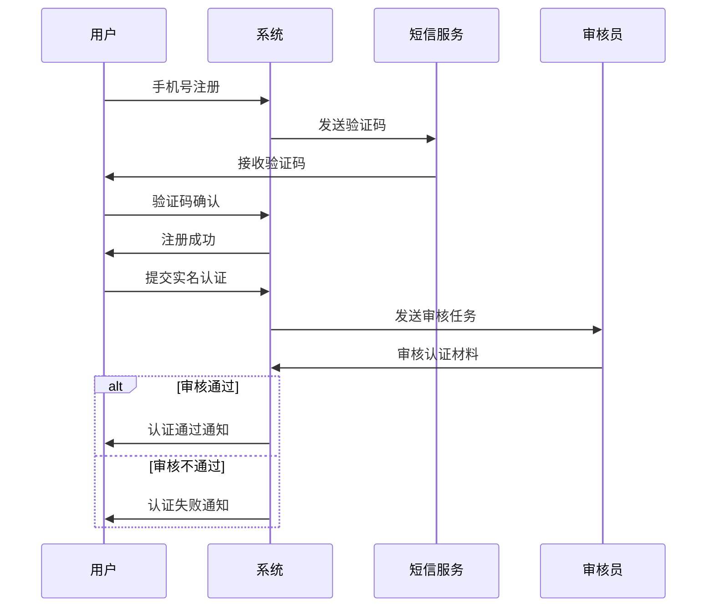
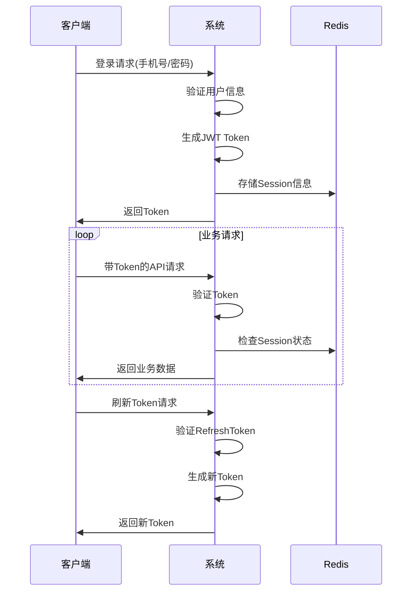

# 用户管理模块 - 数据模型设计文档

## 1. 模块概述

用户管理模块是数字惠农系统的核心基础模块，负责用户注册、认证、权限管理、会话管理等功能。支持多种用户类型：个体农户、家庭农场主、合作社、企业等，以及OA后台管理用户。

### 主要功能特性
- 👤 **多用户类型**: 支持农户、农场主、合作社、企业等不同用户类型
- 🔐 **安全认证**: 多重身份认证，包括实名认证、银行卡认证等
- 🎭 **权限管理**: 基于角色的权限控制(RBAC)系统
- 📱 **多端支持**: 支持移动端、Web端、后台管理等多平台
- 🔄 **会话管理**: 完整的会话生命周期管理，支持单点登录
- 📊 **用户画像**: 基于标签的用户分类和行为分析

## 2. 核心数据模型

### 2.1 users - 核心用户表

```go
type User struct {
    ID              uint64    `gorm:"primaryKey;autoIncrement" json:"id"`
    UUID            string    `gorm:"type:varchar(36);uniqueIndex;not null" json:"uuid"`
    Username        string    `gorm:"type:varchar(50);uniqueIndex" json:"username"`
    Phone           string    `gorm:"type:varchar(20);uniqueIndex;not null" json:"phone"`
    Email           string    `gorm:"type:varchar(100);index" json:"email"`
    PasswordHash    string    `gorm:"type:varchar(255);not null" json:"-"`
    Salt            string    `gorm:"type:varchar(32);not null" json:"-"`
    
    // 用户类型：farmer(个体农户)、farm_owner(农场主)、cooperative(合作社)、enterprise(企业)
    UserType        string    `gorm:"type:varchar(20);not null;default:'farmer'" json:"user_type"`
    
    // 用户状态：active(正常)、frozen(冻结)、deleted(删除)
    Status          string    `gorm:"type:varchar(20);not null;default:'active'" json:"status"`
    
    // 基本信息
    RealName        string    `gorm:"type:varchar(50)" json:"real_name"`
    IDCard          string    `gorm:"type:varchar(18);index" json:"id_card"`
    Avatar          string    `gorm:"type:varchar(255)" json:"avatar"`
    Gender          string    `gorm:"type:varchar(10)" json:"gender"` // male, female, unknown
    Birthday        *time.Time `json:"birthday"`
    
    // 地址信息
    Province        string    `gorm:"type:varchar(50)" json:"province"`
    City            string    `gorm:"type:varchar(50)" json:"city"`
    County          string    `gorm:"type:varchar(50)" json:"county"`
    Address         string    `gorm:"type:varchar(200)" json:"address"`
    Longitude       *float64  `gorm:"type:decimal(10,6)" json:"longitude"`
    Latitude        *float64  `gorm:"type:decimal(10,6)" json:"latitude"`
    
    // 认证状态
    IsRealNameVerified  bool  `gorm:"default:false" json:"is_real_name_verified"`
    IsBankCardVerified  bool  `gorm:"default:false" json:"is_bank_card_verified"`
    IsCreditVerified    bool  `gorm:"default:false" json:"is_credit_verified"`
    
    // 账户信息
    Balance         int64     `gorm:"default:0" json:"balance"`                 // 账户余额(分)
    CreditScore     int       `gorm:"default:0" json:"credit_score"`            // 信用分数
    CreditLevel     string    `gorm:"type:varchar(10)" json:"credit_level"`     // 信用等级
    
    // 登录信息
    LastLoginTime   *time.Time `json:"last_login_time"`
    LastLoginIP     string    `gorm:"type:varchar(45)" json:"last_login_ip"`
    LoginCount      uint32    `gorm:"default:0" json:"login_count"`
    
    // 统计信息
    TotalOrders     int       `gorm:"default:0" json:"total_orders"`            // 总订单数
    TotalSpent      int64     `gorm:"default:0" json:"total_spent"`             // 总消费金额(分)
    
    // 时间字段
    CreatedAt       time.Time `json:"created_at"`
    UpdatedAt       time.Time `json:"updated_at"`
    DeletedAt       gorm.DeletedAt `gorm:"index" json:"-"`
}

// 表索引设计
/*
CREATE INDEX idx_users_phone ON users(phone);
CREATE INDEX idx_users_user_type ON users(user_type);
CREATE INDEX idx_users_status ON users(status);
CREATE INDEX idx_users_id_card ON users(id_card);
CREATE INDEX idx_users_created_at ON users(created_at);
*/
```

### 2.2 user_auths - 用户认证信息表

```go
type UserAuth struct {
    ID          uint64    `gorm:"primaryKey;autoIncrement" json:"id"`
    UserID      uint64    `gorm:"not null;index" json:"user_id"`
    
    // 认证类型：real_name(实名认证)、bank_card(银行卡认证)、credit(征信认证)
    AuthType    string    `gorm:"type:varchar(20);not null" json:"auth_type"`
    
    // 认证状态：pending(待审核)、approved(通过)、rejected(拒绝)、expired(过期)
    AuthStatus  string    `gorm:"type:varchar(20);not null;default:'pending'" json:"auth_status"`
    
    // 认证数据(JSON格式存储)
    AuthData    string    `gorm:"type:json" json:"auth_data"`
    
    // 审核信息
    ReviewerID  *uint64   `json:"reviewer_id"`
    ReviewNote  string    `gorm:"type:text" json:"review_note"`
    ReviewedAt  *time.Time `json:"reviewed_at"`
    
    // 有效期
    ExpiresAt   *time.Time `json:"expires_at"`
    
    CreatedAt   time.Time `json:"created_at"`
    UpdatedAt   time.Time `json:"updated_at"`
    
    // 关联
    User        User      `gorm:"foreignKey:UserID" json:"user,omitempty"`
    Reviewer    *OAUser   `gorm:"foreignKey:ReviewerID" json:"reviewer,omitempty"`
}

// AuthData 结构体定义
type RealNameAuthData struct {
    IDCardNumber    string `json:"id_card_number"`
    RealName        string `json:"real_name"`
    IDCardFrontImg  string `json:"id_card_front_img"`
    IDCardBackImg   string `json:"id_card_back_img"`
    FaceVerifyImg   string `json:"face_verify_img"`
    VerifyResult    string `json:"verify_result"`
}

type BankCardAuthData struct {
    BankCardNumber  string `json:"bank_card_number"`
    BankName        string `json:"bank_name"`
    CardholderName  string `json:"cardholder_name"`
    BankCode        string `json:"bank_code"`
    CardType        string `json:"card_type"`
}

type CreditAuthData struct {
    CreditScore     int    `json:"credit_score"`
    CreditLevel     string `json:"credit_level"`
    CreditReportUrl string `json:"credit_report_url"`
    ProviderName    string `json:"provider_name"`
    ReportDate      string `json:"report_date"`
}
```

### 2.3 user_sessions - 用户会话管理表

```go
type UserSession struct {
    ID          uint64    `gorm:"primaryKey;autoIncrement" json:"id"`
    UserID      uint64    `gorm:"not null;index" json:"user_id"`
    SessionID   string    `gorm:"type:varchar(64);uniqueIndex;not null" json:"session_id"`
    
    // 平台类型：app(移动应用)、web(网页)、oa(后台管理)
    Platform    string    `gorm:"type:varchar(10);not null" json:"platform"`
    
    // 设备信息
    DeviceID    string    `gorm:"type:varchar(64)" json:"device_id"`
    DeviceType  string    `gorm:"type:varchar(20)" json:"device_type"` // ios, android, web
    AppVersion  string    `gorm:"type:varchar(20)" json:"app_version"`
    UserAgent   string    `gorm:"type:text" json:"user_agent"`
    
    // IP和地理位置
    IPAddress   string    `gorm:"type:varchar(45)" json:"ip_address"`
    Location    string    `gorm:"type:varchar(100)" json:"location"`
    
    // JWT Token信息
    AccessToken string    `gorm:"type:text" json:"-"`
    RefreshToken string   `gorm:"type:text" json:"-"`
    TokenExpiresAt *time.Time `json:"token_expires_at"`
    RefreshExpiresAt *time.Time `json:"refresh_expires_at"`
    
    // 会话状态：active(活跃)、expired(过期)、revoked(撤销)
    Status      string    `gorm:"type:varchar(20);not null;default:'active'" json:"status"`
    
    // 最后活跃时间
    LastActiveAt time.Time `json:"last_active_at"`
    
    CreatedAt   time.Time `json:"created_at"`
    UpdatedAt   time.Time `json:"updated_at"`
    
    // 关联
    User        User      `gorm:"foreignKey:UserID" json:"user,omitempty"`
}
```

### 2.4 user_tags - 用户标签表

```go
type UserTag struct {
    ID          uint64    `gorm:"primaryKey;autoIncrement" json:"id"`
    UserID      uint64    `gorm:"not null;index" json:"user_id"`
    
    // 标签类型：behavior(行为标签)、preference(偏好标签)、attribute(属性标签)、custom(自定义标签)
    TagType     string    `gorm:"type:varchar(20);not null" json:"tag_type"`
    
    // 标签键值
    TagKey      string    `gorm:"type:varchar(50);not null" json:"tag_key"`
    TagValue    string    `gorm:"type:varchar(200)" json:"tag_value"`
    
    // 标签权重和有效期
    Weight      float64   `gorm:"default:1.0" json:"weight"`
    ExpiresAt   *time.Time `json:"expires_at"`
    
    // 标签来源：system(系统生成)、manual(手动添加)、import(导入)
    Source      string    `gorm:"type:varchar(20);not null" json:"source"`
    
    CreatedAt   time.Time `json:"created_at"`
    UpdatedAt   time.Time `json:"updated_at"`
    
    // 关联
    User        User      `gorm:"foreignKey:UserID" json:"user,omitempty"`
}

// 常用标签定义
const (
    // 行为标签
    TagActiveLoan     = "active_loan"      // 活跃借贷用户
    TagFrequentMachine = "frequent_machine" // 频繁租赁农机
    TagHighValue      = "high_value"       // 高价值用户
    
    // 偏好标签
    TagPreferMachine  = "prefer_machine"   // 偏好农机类型
    TagPreferPayment  = "prefer_payment"   // 偏好支付方式
    TagPreferTime     = "prefer_time"      // 偏好使用时间
    
    // 属性标签
    TagLandArea       = "land_area"        // 土地面积
    TagCropType       = "crop_type"        // 种植作物类型
    TagExperience     = "experience"       // 种植经验
)
```

### 2.5 oa_users - OA后台管理用户表

```go
type OAUser struct {
    ID          uint64    `gorm:"primaryKey;autoIncrement" json:"id"`
    Username    string    `gorm:"type:varchar(50);uniqueIndex;not null" json:"username"`
    Email       string    `gorm:"type:varchar(100);uniqueIndex;not null" json:"email"`
    Phone       string    `gorm:"type:varchar(20);index" json:"phone"`
    PasswordHash string   `gorm:"type:varchar(255);not null" json:"-"`
    Salt        string    `gorm:"type:varchar(32);not null" json:"-"`
    
    // 基本信息
    RealName    string    `gorm:"type:varchar(50);not null" json:"real_name"`
    Avatar      string    `gorm:"type:varchar(255)" json:"avatar"`
    EmployeeNo  string    `gorm:"type:varchar(20);uniqueIndex" json:"employee_no"`
    
    // 角色权限
    RoleID      uint64    `gorm:"not null;index" json:"role_id"`
    Department  string    `gorm:"type:varchar(50)" json:"department"`
    Position    string    `gorm:"type:varchar(50)" json:"position"`
    
    // 状态：active(正常)、frozen(冻结)、resigned(离职)
    Status      string    `gorm:"type:varchar(20);not null;default:'active'" json:"status"`
    
    // 登录信息
    LastLoginTime *time.Time `json:"last_login_time"`
    LastLoginIP string    `gorm:"type:varchar(45)" json:"last_login_ip"`
    LoginCount  uint32    `gorm:"default:0" json:"login_count"`
    
    // 安全设置
    TwoFactorEnabled bool   `gorm:"default:false" json:"two_factor_enabled"`
    TwoFactorSecret  string `gorm:"type:varchar(32)" json:"-"`
    PasswordExpiresAt *time.Time `json:"password_expires_at"`
    MustChangePassword bool `gorm:"default:false" json:"must_change_password"`
    
    // 入职离职时间
    HiredAt     *time.Time `json:"hired_at"`
    ResignedAt  *time.Time `json:"resigned_at"`
    
    CreatedAt   time.Time `json:"created_at"`
    UpdatedAt   time.Time `json:"updated_at"`
    DeletedAt   gorm.DeletedAt `gorm:"index" json:"-"`
    
    // 关联
    Role        OARole    `gorm:"foreignKey:RoleID" json:"role,omitempty"`
}
```

### 2.6 oa_roles - OA角色表

```go
type OARole struct {
    ID          uint64    `gorm:"primaryKey;autoIncrement" json:"id"`
    RoleName    string    `gorm:"type:varchar(50);uniqueIndex;not null" json:"role_name"`
    RoleCode    string    `gorm:"type:varchar(20);uniqueIndex;not null" json:"role_code"`
    Description string    `gorm:"type:varchar(200)" json:"description"`
    
    // 权限列表(JSON数组)
    Permissions string    `gorm:"type:json" json:"permissions"`
    
    // 角色级别：1-9，数字越小权限越高
    Level       int       `gorm:"not null" json:"level"`
    
    // 排序权重
    SortOrder   int       `gorm:"default:0" json:"sort_order"`
    
    // 是否启用
    IsActive    bool      `gorm:"default:true" json:"is_active"`
    
    CreatedAt   time.Time `json:"created_at"`
    UpdatedAt   time.Time `json:"updated_at"`
    DeletedAt   gorm.DeletedAt `gorm:"index" json:"-"`
}

// 权限定义
const (
    // 用户管理权限
    PermUserView   = "user:view"
    PermUserCreate = "user:create"
    PermUserUpdate = "user:update"
    PermUserDelete = "user:delete"
    
    // 贷款管理权限
    PermLoanView    = "loan:view"
    PermLoanApprove = "loan:approve"
    PermLoanReject  = "loan:reject"
    
    // 农机管理权限
    PermMachineView   = "machine:view"
    PermMachineVerify = "machine:verify"
    
    // 系统管理权限
    PermSystemConfig = "system:config"
    PermSystemLog    = "system:log"
    PermSystemStats  = "system:stats"
    
    // 超级管理员
    PermSuperAdmin = "super:admin"
)
```

## 3. 数据库关系设计

### 3.1 实体关系图(ERD)

```
┌─────────────────┐    1:N    ┌─────────────────┐
│      User       │◄─────────►│    UserAuth     │
└─────────────────┘           └─────────────────┘
         │                             │
        1:N                           N:1
         ▼                             ▼
┌─────────────────┐           ┌─────────────────┐
│   UserSession   │           │     OAUser      │
└─────────────────┘           │   (Reviewer)    │
         │                    └─────────────────┘
        1:N                            │
         ▼                            N:1
┌─────────────────┐                    ▼
│    UserTag      │           ┌─────────────────┐
└─────────────────┘           │     OARole      │
                               └─────────────────┘
```

### 3.2 主要关联关系

1. **用户 ↔ 认证信息**: 一个用户可以有多个认证记录(实名、银行卡等)
2. **用户 ↔ 会话**: 一个用户可以在多个设备同时登录
3. **用户 ↔ 标签**: 一个用户可以有多个标签，支持用户画像
4. **OA用户 ↔ 角色**: 多对一关系，一个角色可以分配给多个用户
5. **OA用户 ↔ 认证审核**: OA用户作为审核员审核用户认证

## 4. 业务流程设计

### 4.1 用户注册认证流程



### 4.2 JWT认证流程



### 4.3 权限验证流程

```go
// 权限验证中间件
func AuthMiddleware() gin.HandlerFunc {
    return func(c *gin.Context) {
        // 1. 提取Token
        token := extractToken(c)
        if token == "" {
            c.JSON(401, gin.H{"error": "Token required"})
            c.Abort()
            return
        }
        
        // 2. 验证Token
        claims, err := validateToken(token)
        if err != nil {
            c.JSON(401, gin.H{"error": "Invalid token"})
            c.Abort()
            return
        }
        
        // 3. 检查会话状态
        session, err := getSession(claims.SessionID)
        if err != nil || session.Status != "active" {
            c.JSON(401, gin.H{"error": "Session expired"})
            c.Abort()
            return
        }
        
        // 4. 设置用户信息到上下文
        c.Set("userID", claims.UserID)
        c.Set("userType", claims.UserType)
        c.Next()
    }
}

// 权限检查中间件
func RequirePermission(permission string) gin.HandlerFunc {
    return func(c *gin.Context) {
        userID := c.GetUint64("userID")
        userType := c.GetString("userType")
        
        if userType == "oa_user" {
            // OA用户权限检查
            hasPermission, err := checkOAUserPermission(userID, permission)
            if err != nil || !hasPermission {
                c.JSON(403, gin.H{"error": "Permission denied"})
                c.Abort()
                return
            }
        } else {
            // 普通用户权限检查
            hasPermission, err := checkUserPermission(userID, permission)
            if err != nil || !hasPermission {
                c.JSON(403, gin.H{"error": "Permission denied"})
                c.Abort()
                return
            }
        }
        
        c.Next()
    }
}
```

## 5. 服务层实现

### 5.1 UserService接口定义

```go
type UserService interface {
    // 用户注册登录
    RegisterByPhone(ctx context.Context, req *RegisterByPhoneRequest) (*RegisterResponse, error)
    Login(ctx context.Context, req *LoginRequest) (*LoginResponse, error)
    Logout(ctx context.Context, sessionID string) error
    RefreshToken(ctx context.Context, refreshToken string) (*RefreshTokenResponse, error)
    
    // 用户信息管理
    GetUserProfile(ctx context.Context, userID uint64) (*User, error)
    UpdateUserProfile(ctx context.Context, req *UpdateProfileRequest) error
    UploadAvatar(ctx context.Context, userID uint64, fileData []byte) (string, error)
    ChangePassword(ctx context.Context, req *ChangePasswordRequest) error
    
    // 认证管理
    SubmitRealNameAuth(ctx context.Context, req *SubmitRealNameAuthRequest) error
    SubmitBankCardAuth(ctx context.Context, req *SubmitBankCardAuthRequest) error
    GetUserAuthStatus(ctx context.Context, userID uint64) (*UserAuthStatusResponse, error)
    
    // 标签管理
    AddUserTag(ctx context.Context, req *AddUserTagRequest) error
    GetUserTags(ctx context.Context, userID uint64, tagType string) ([]*UserTag, error)
    RemoveUserTag(ctx context.Context, userID uint64, tagKey string) error
    
    // 会话管理
    GetUserSessions(ctx context.Context, userID uint64) ([]*UserSession, error)
    RevokeSession(ctx context.Context, sessionID string) error
    RevokeAllSessions(ctx context.Context, userID uint64) error
}
```

### 5.2 核心业务逻辑

#### 用户注册逻辑
```go
func (s *userService) RegisterByPhone(ctx context.Context, req *RegisterByPhoneRequest) (*RegisterResponse, error) {
    // 1. 验证手机验证码
    if !s.smsService.VerifyCode(req.Phone, req.Code) {
        return nil, fmt.Errorf("验证码错误")
    }
    
    // 2. 检查手机号是否已注册
    existingUser, _ := s.userRepo.GetByPhone(ctx, req.Phone)
    if existingUser != nil {
        return nil, fmt.Errorf("手机号已注册")
    }
    
    // 3. 生成用户UUID和密码哈希
    userUUID := uuid.New().String()
    salt := generateSalt()
    passwordHash := hashPassword(req.Password, salt)
    
    // 4. 创建用户
    user := &model.User{
        UUID:         userUUID,
        Phone:        req.Phone,
        UserType:     req.UserType,
        PasswordHash: passwordHash,
        Salt:         salt,
        Status:       "active",
    }
    
    if err := s.userRepo.Create(ctx, user); err != nil {
        return nil, err
    }
    
    // 5. 创建默认标签
    s.addDefaultTags(ctx, user.ID, req.UserType)
    
    return &RegisterResponse{
        UserID: user.ID,
        UUID:   userUUID,
    }, nil
}
```

#### 登录认证逻辑
```go
func (s *userService) Login(ctx context.Context, req *LoginRequest) (*LoginResponse, error) {
    // 1. 获取用户信息
    user, err := s.userRepo.GetByPhone(ctx, req.Phone)
    if err != nil {
        return nil, fmt.Errorf("用户不存在")
    }
    
    // 2. 验证密码
    if !verifyPassword(req.Password, user.Salt, user.PasswordHash) {
        return nil, fmt.Errorf("密码错误")
    }
    
    // 3. 检查用户状态
    if user.Status != "active" {
        return nil, fmt.Errorf("账户已被冻结")
    }
    
    // 4. 生成JWT Token
    sessionID := generateSessionID()
    accessToken, err := s.generateAccessToken(user.ID, user.UserType, sessionID)
    if err != nil {
        return nil, err
    }
    
    refreshToken, err := s.generateRefreshToken(user.ID, sessionID)
    if err != nil {
        return nil, err
    }
    
    // 5. 创建会话记录
    session := &model.UserSession{
        UserID:       user.ID,
        SessionID:    sessionID,
        Platform:     req.Platform,
        DeviceID:     req.DeviceID,
        DeviceType:   req.DeviceType,
        AppVersion:   req.AppVersion,
        IPAddress:    req.IPAddress,
        AccessToken:  accessToken,
        RefreshToken: refreshToken,
        TokenExpiresAt: time.Now().Add(24 * time.Hour),
        RefreshExpiresAt: time.Now().Add(7 * 24 * time.Hour),
        Status:       "active",
        LastActiveAt: time.Now(),
    }
    
    if err := s.userRepo.CreateSession(ctx, session); err != nil {
        return nil, err
    }
    
    // 6. 更新登录信息
    s.userRepo.UpdateLoginInfo(ctx, user.ID, req.IPAddress)
    
    return &LoginResponse{
        AccessToken:  accessToken,
        RefreshToken: refreshToken,
        ExpiresIn:    86400, // 24小时
        UserInfo: &UserInfo{
            ID:       user.ID,
            UUID:     user.UUID,
            Phone:    user.Phone,
            UserType: user.UserType,
            RealName: user.RealName,
            Avatar:   user.Avatar,
        },
    }, nil
}
```

## 6. Repository层实现

### 6.1 UserRepository接口

```go
type UserRepository interface {
    // 基本CRUD
    Create(ctx context.Context, user *model.User) error
    GetByID(ctx context.Context, id uint64) (*model.User, error)
    GetByPhone(ctx context.Context, phone string) (*model.User, error)
    GetByUUID(ctx context.Context, uuid string) (*model.User, error)
    Update(ctx context.Context, user *model.User) error
    Delete(ctx context.Context, id uint64) error
    
    // 查询方法
    List(ctx context.Context, req *ListUsersRequest) (*ListUsersResponse, error)
    GetByUserType(ctx context.Context, userType string, limit, offset int) ([]*model.User, error)
    GetByStatus(ctx context.Context, status string, limit, offset int) ([]*model.User, error)
    
    // 登录信息更新
    UpdateLoginInfo(ctx context.Context, userID uint64, loginIP string) error
    
    // 认证相关
    GetUserAuth(ctx context.Context, userID uint64, authType string) (*model.UserAuth, error)
    CreateUserAuth(ctx context.Context, auth *model.UserAuth) error
    UpdateUserAuth(ctx context.Context, auth *model.UserAuth) error
    
    // 会话管理
    CreateSession(ctx context.Context, session *model.UserSession) error
    GetSession(ctx context.Context, sessionID string) (*model.UserSession, error)
    UpdateSession(ctx context.Context, session *model.UserSession) error
    DeleteSession(ctx context.Context, sessionID string) error
    GetUserSessions(ctx context.Context, userID uint64) ([]*model.UserSession, error)
    
    // 标签管理
    AddUserTag(ctx context.Context, tag *model.UserTag) error
    GetUserTags(ctx context.Context, userID uint64, tagType string) ([]*model.UserTag, error)
    RemoveUserTag(ctx context.Context, userID uint64, tagKey string) error
    
    // 统计方法
    GetUserCount(ctx context.Context) (int64, error)
    GetUserCountByType(ctx context.Context, userType string) (int64, error)
}
```

## 7. API接口设计

### 7.1 用户端接口

```
POST   /api/v1/auth/register               # 用户注册
POST   /api/v1/auth/login                  # 用户登录
POST   /api/v1/auth/logout                 # 用户登出
POST   /api/v1/auth/refresh                # 刷新Token
GET    /api/v1/user/profile                # 获取个人信息
PUT    /api/v1/user/profile                # 更新个人信息
POST   /api/v1/user/avatar                 # 上传头像
PUT    /api/v1/user/password               # 修改密码
POST   /api/v1/user/auth/realname          # 实名认证
POST   /api/v1/user/auth/bankcard          # 银行卡认证
GET    /api/v1/user/auth/status            # 认证状态
GET    /api/v1/user/sessions               # 登录设备
DELETE /api/v1/user/sessions/{sessionId}   # 踢出设备
```

### 7.2 管理端接口

```
GET    /api/v1/admin/users                 # 用户列表
GET    /api/v1/admin/users/{id}            # 用户详情
PUT    /api/v1/admin/users/{id}/status     # 修改用户状态
GET    /api/v1/admin/users/{id}/auths      # 用户认证记录
POST   /api/v1/admin/auths/{id}/review     # 审核认证
GET    /api/v1/admin/users/statistics      # 用户统计
GET    /api/v1/admin/roles                 # 角色管理
POST   /api/v1/admin/roles                 # 创建角色
PUT    /api/v1/admin/roles/{id}            # 更新角色
```

## 8. 技术实现要点

### 8.1 密码安全
- 使用bcrypt进行密码哈希
- 每个用户独立的盐值
- 密码强度验证

### 8.2 JWT认证
- 短期AccessToken + 长期RefreshToken机制
- Token黑名单管理
- 多设备登录控制

### 8.3 数据脱敏
- API返回时自动过滤敏感字段
- 日志记录时脱敏处理
- 身份证号部分隐藏

### 8.4 性能优化
- 用户信息缓存
- 会话状态Redis存储
- 数据库连接池优化

### 8.5 安全防护
- 登录频次限制
- 密码错误次数限制
- IP黑名单机制

## 9. 扩展性设计

### 9.1 用户类型扩展
- 支持新增用户类型
- 不同类型用户权限区分

### 9.2 认证方式扩展
- 支持第三方登录(微信、支付宝)
- 生物识别认证集成

### 9.3 标签系统扩展
- 智能标签自动生成
- 标签权重算法优化

该设计既保证了数据的规范性和安全性，又具备良好的扩展性，能够满足数字惠农项目的用户管理需求。 