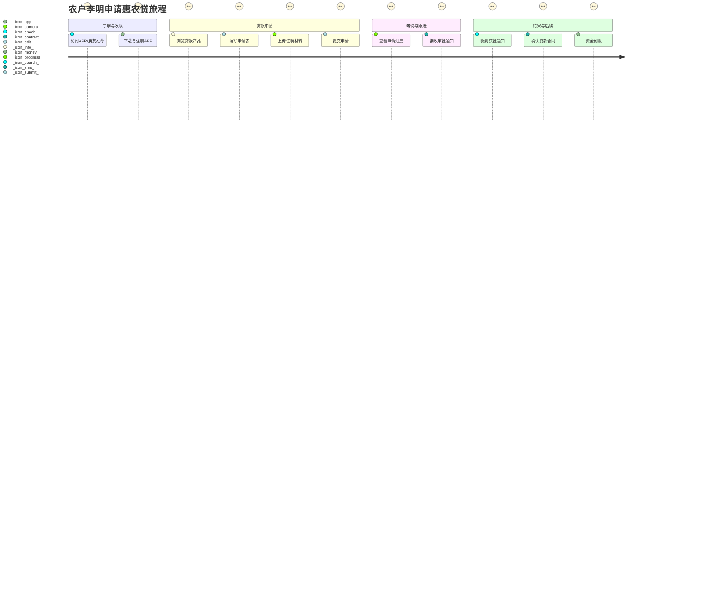
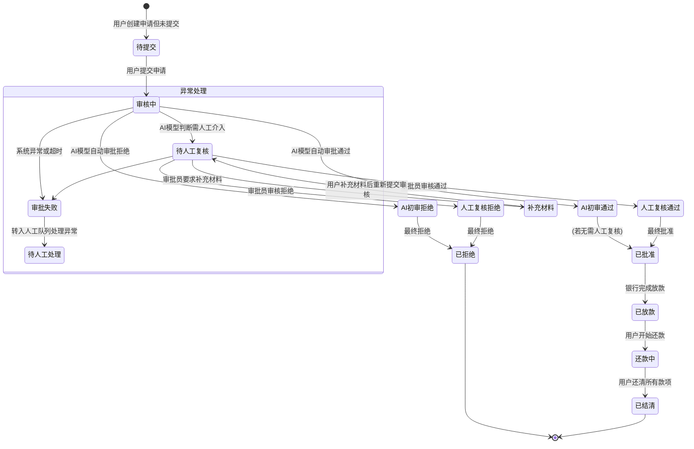
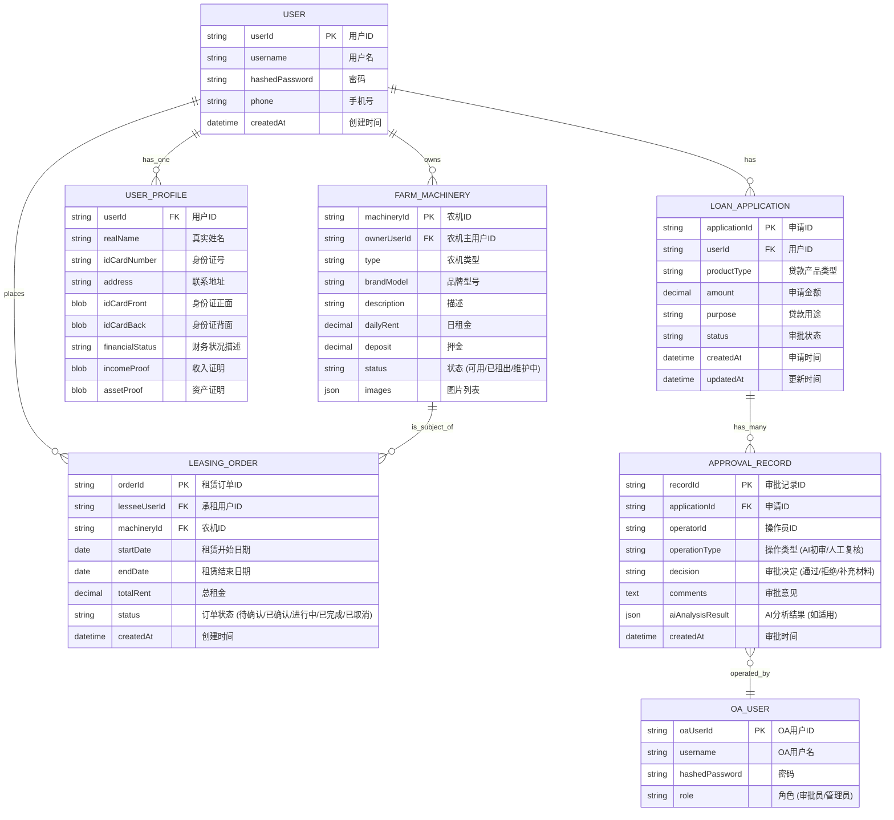

# 产品需求文档 (PRD): 数字惠农APP及OA后台管理系统

## 1. 文档信息

### 1.1 版本历史

| 版本号 | 日期       | 作者 | 变更说明                                     |
| ------ | ---------- | ---- | -------------------------------------------- |
| 1.0    | (今日日期) | 产品经理 | 初稿创建，基于现有需求文档和项目整体流程进行优化 |

### 1.2 文档目的

本文档旨在明确"数字惠农APP及OA后台管理系统"的产品需求，作为产品设计、研发、测试和运营等后续工作的核心依据。本文档详细描述了产品的目标、功能、用户、市场、技术考量及成功指标，确保项目团队对产品有统一和清晰的理解。

### 1.3 相关文档引用

- `docs/Roadmap.md` (产品路线图)
- `docs/User_Story_Map.md` (用户故事地图)
- `docs/Metrics_Framework.md` (产品评估指标框架)
- (如有其他相关文档，例如UI设计稿链接，可在此处添加)

## 2. 产品概述

### 2.1 产品名称与定位

- **产品名称**: 数字惠农APP及OA后台管理系统
- **产品定位**: 一款面向农村用户，提供便捷金融服务（如惠农贷、农机租赁）的应用程序，并配套一个集成AI智能审批能力的OA后台管理系统，旨在提升金融服务效率和用户体验，支持乡村振兴发展。

### 2.2 产品愿景与使命

- **产品愿景**: 成为领先的数字普惠金融服务平台，赋能乡村经济发展，让每一位农户都能便捷地享受到现代金融服务。
- **产品使命**: 通过技术创新，简化农村金融服务流程，降低服务门槛，提高审批效率，连接金融机构与农户，促进农村经济的数字化转型。

### 2.3 价值主张与独特卖点 (USP)

- **对用户 (农户)**:
    - **便捷申请**: 随时随地通过APP或网页端申请贷款、租赁农机等服务。
    - **快速审批**: AI智能审批结合人工复核，大幅缩短等待时间。
    - **透明进度**: 实时查询申请状态，了解审批详情。
    - **专属服务**: 提供针对性的惠农政策资讯和金融产品。
- **对银行/金融机构 (系统使用者)**:
    - **高效运营**: 自动化审批流程，减轻人工压力，提升处理效率。
    - **智能风控**: 基于AI和大数据分析，实现更精准的风险评估。
    - **数据驱动**: 全面记录业务数据，支持数据分析与决策。
    - **灵活管理**: 可配置的审批流程和人工干预机制。
- **独特卖点 (USP)**:
    - **端到端数字普惠金融解决方案**: 从用户申请到后台智能审批的全流程数字化。
    - **AI驱动的智能审批引擎**: 基于Dify平台和本地化大模型，实现高效、精准的自动化审批。
    - **国产化技术栈与本地化部署**: 满足特定环境下的安全可控要求。
    - **MCP工具集成**: 提升审批流程的自动化和智能化水平。
    - **微服务架构与K8S部署**: 保证系统的高可用性、可扩展性和可维护性。

### 2.4 目标平台列表

- **用户端**:
    - 移动应用 (iOS, Android)
    - Web网页版
- **OA后台管理系统**:
    - Web网页版 (适配主流桌面浏览器)

### 2.5 产品核心假设

- 农村用户对便捷、高效的线上金融服务有强烈需求。
- AI技术能够有效提升金融审批的效率和准确性。
- 本地化部署和国产化技术能够满足项目的安全和合规要求。
- 目标用户具备使用智能手机或电脑进行基本操作的能力。

### 2.6 商业模式概述 (如适用)

- **主要收入来源**:
    - 贷款利息分成 (与合作金融机构)
    - 农机租赁服务费
- **成本构成**:
    - 技术研发与维护成本
    - 服务器与基础设施成本
    - 市场推广与用户获取成本
    - AI模型训练与优化成本

## 3. 用户研究

### 3.1 目标用户画像

#### 3.1.1 用户画像1: 李明 (普通农户/种植户)

- **人口统计特征**:
    - 年龄: 30-55岁
    - 性别: 不限
    - 地点: 中国农村地区
    - 职业: 农民，从事粮食种植或经济作物种植
    - 教育程度: 初中至高中
    - 收入水平: 相对较低，季节性波动大
    - 家庭情况: 已婚，有子女
- **行为习惯与偏好**:
    - 对智能手机有一定使用经验，主要用于通讯、社交、获取信息。
    - 关注惠农政策、农业技术、农产品价格等信息。
    - 融资渠道有限，对贷款审批流程繁琐、等待时间长感到困扰。
    - 倾向于使用简单易懂、操作便捷的应用程序。
- **核心需求与痛点**:
    - **需求**:
        - 快速获得小额生产经营贷款，用于购买种子、化肥、农药等。
        - 方便地租赁到合适的农机，提高生产效率。
        - 了解最新的惠农政策和补贴信息。
    - **痛点**:
        - 传统银行贷款门槛高、手续复杂、审批慢。
        - 农机租赁信息不对称，难以找到合适的农机。
        - 缺乏获取可靠信息的渠道。
- **动机与目标**:
    - 扩大生产规模，提高农业收入，改善生活水平。
    - 及时获取资金支持，不错过农时。
    - 降低生产成本，提高生产效率。

#### 3.1.2 用户画像2: 王强 (农机合作社负责人)

- **人口统计特征**:
    - 年龄: 35-60岁
    - 性别: 男性居多
    - 地点: 中国农村地区，可能有一定的经营规模
    - 职业: 农机合作社负责人
    - 教育程度: 高中或中专以上
    - 收入水平: 相对较高，有稳定的经营收入
- **行为习惯与偏好**:
    - 熟练使用智能手机和电脑，对新技术接受度较高。
    - 关注行业动态、管理效率提升、成本控制。
    - 对金融服务的需求额度较大，对服务专业性有要求。
- **核心需求与痛点**:
    - **需求**:
        - 获得较大额度的经营性贷款，用于购买新农机。
        - 高效管理农机设备，提供农机租赁服务。
    - **痛点**:
        - 大额贷款审批流程依然复杂，对抵押物要求高。
        - 农机管理和调度效率有待提升。
- **动机与目标**:
    - 扩大经营规模，打造区域性农业服务品牌。
    - 提升管理水平，实现降本增效。
    - 应用新技术，引领现代农业发展。

#### 3.1.3 用户画像3: 张伟 (银行/金融机构审批员 - OA后台用户)

- **人口统计特征**:
    - 年龄: 25-45岁
    - 性别: 不限
    - 地点: 县市级银行或金融机构网点
    - 职业: 信贷审批员、客户经理
    - 教育程度: 大专及以上，金融、经济相关专业
- **行为习惯与偏好**:
    - 熟练使用办公软件和业务系统。
    - 工作任务重，需要在规定时间内处理大量审批申请。
    - 关注审批效率、风险控制和合规性。
- **核心需求与痛点**:
    - **需求**:
        - 快速获取申请人的完整信息和AI初步审批建议。
        - 高效处理待审批任务，特别是对于需要人工复核的复杂案件。
        - 清晰了解审批流程和决策依据。
        - 系统稳定可靠，操作便捷。
    - **痛点**:
        - 人工审核耗时耗力，重复性工作多。
        - 传统审批流程信息分散，查找不便。
        - 风险识别依赖个人经验，可能存在偏差。
- **动机与目标**:
    - 提高工作效率，减少积压案件。
    - 提升审批质量，有效控制风险。
    - 确保业务操作符合监管要求。

### 3.2 用户场景分析

#### 3.2.1 核心使用场景详述

**场景1: 农户李明申请惠农贷**

1.  **触发**: 李明需要购买化肥，但手头资金不足。
2.  **行为**:
    *   打开数字惠农APP，进入"惠农贷"申请页面。
    *   按照提示填写个人信息（姓名、身份证、联系方式）、贷款金额、用途等。
    *   上传身份证照片、土地承包合同照片等证明材料。
    *   阅读并同意信用授权协议。
    *   提交申请。
3.  **后续**:
    *   APP提示申请已提交，可随时在"进度查询"中查看状态。
    *   李明收到短信通知，告知申请已进入审批流程。
    *   （后台）系统自动进行信息校验、风险评估。对于符合条件的简单申请，AI自动通过；对于需要进一步审核的，转入人工处理。
    *   李明在"进度查询"中看到状态更新为"已批准"，并收到放款通知。

**场景2: 农机合作社王强发布农机租赁信息并处理租赁申请**

1.  **触发**: 王强的合作社新购入一台拖拉机，希望通过平台出租。
2.  **行为 (发布)**:
    *   登录数字惠农APP/网页版，进入"我的农机"或"农机管理"模块。
    *   点击"发布农机"，填写农机型号、品牌、日租金、押金、可用时段、农机照片等信息。
    *   提交信息，等待平台审核（如需要）。
3.  **行为 (处理申请)**:
    *   收到用户租赁其拖拉机的申请通知。
    *   在APP/网页版查看申请人信息、租赁时长等。
    *   （可选）通过APP内置聊天或电话联系申请人确认细节。
    *   同意或拒绝租赁申请。
    *   若同意，与用户线下或通过平台约定完成交付和收款。

**场景3: 银行审批员张伟处理需要人工复核的贷款申请**

1.  **触发**: OA后台系统中出现一笔状态为"待人工复核"的惠农贷申请。
2.  **行为**:
    *   张伟登录OA后台管理系统，进入"审批看板"。
    *   找到该笔申请，点击进入"智能审批详情页"。
    *   查看AI给出的信息收集报告、数据验证结果、风险评估得分及初步建议。
    *   仔细核对申请人提交的材料和系统抓取的相关信息。
    *   根据银行风控政策和自身专业判断，给出最终审批意见（通过/拒绝/补充材料）。
    *   在系统中提交审批结果和意见。
3.  **后续**:
    *   系统更新申请状态，并通知申请人。
    *   相关数据记入审批历史。

#### 3.2.2 边缘使用场景考量

- 用户忘记密码，需要找回密码。
- 用户提交申请后，发现信息填写错误，需要修改或撤销。
- 用户对审批结果有异议，需要申诉或联系客服。
- OA后台管理员需要配置审批规则或管理系统用户权限。
- 网络环境较差的农村地区，APP的离线数据缓存和弱网优化。

### 3.3 用户调研洞察 (如适用)

*(此部分需根据实际用户调研结果填充，以下为占位符)*

- 调研发现，大部分农户对线上操作存在一定的学习门槛，界面设计需极致简洁易懂。
- 许多用户担心个人信息安全问题，需要重点突出数据安全保障措施。
- 用户希望审批流程尽可能透明，能清晰了解每一步的进展和原因。

## 4. 市场与竞品分析

*(此部分为通用框架，具体数据和分析需根据实际调研填充)*

### 4.1 市场规模与增长预测

- 普惠金融市场，特别是农村金融市场的规模及近年增长率。
- 数字农业、智慧农业相关技术应用的市场渗透率和发展趋势。
- 国家相关政策对数字惠农项目的扶持力度和预期影响。

### 4.2 行业趋势分析

- 金融科技 (FinTech) 在农业领域的应用深化。
- AI、大数据在信贷风控、精准营销等方面的应用普及。
- 移动支付和线上服务在农村地区的快速发展。
- 对数据安全和隐私保护的日益重视。
- 农业生产的规模化、集约化趋势对金融服务的需求升级。

### 4.3 竞争格局分析

#### 4.3.1 直接竞争对手详析

*(列举市场上已有的类似数字惠农APP或农村金融服务平台)*

- **对手A (例如: XX银行农户贷APP)**
    - **优势**: 品牌背书强，资金实力雄厚，线下网点多。
    - **劣势**: 产品迭代慢，审批流程可能仍较传统，用户体验一般。
    - **定价**: 标准银行贷款利率。
    - **特性对比**: (与本产品进行功能、体验等方面的详细对比)
- **对手B (例如: 某互联网金融平台农业板块)**
    - **优势**: 互联网运营经验丰富，用户体验较好，审批速度可能较快。
    - **劣势**: 可能缺乏对农业领域的深度理解，风控模型可能不完全适用，数据安全可能存在顾虑。
    - **定价**: 可能采取更灵活的利率策略。
    - **特性对比**: (与本产品进行功能、体验等方面的详细对比)

#### 4.3.2 间接竞争对手概述

- 传统线下小额贷款公司、农村信用社。
- 大型电商平台的农村金融服务。
- 农业服务公司提供的包含金融支持的综合服务。

### 4.4 竞品功能对比矩阵

| 功能点         | 本产品 (数字惠农) | 对手A | 对手B |
| -------------- | ----------------- | ----- | ----- |
| 惠农贷申请     | 支持 (AI审批)     | 支持  | 支持  |
| 农机租赁       | 支持              | 不支持 | 可能支持 |
| 政策资讯       | 支持              | 支持  | 部分支持 |
| 审批效率       | 高 (目标)         | 中    | 中高  |
| 用户体验       | 优 (目标)         | 一般  | 较好  |
| 本地化部署能力 | 强                | 弱    | 弱    |
| AI能力        | Dify, 本地大模型 | 较弱  | 可能有 |
| ...            | ...               | ...   | ...   |

### 4.5 市场差异化策略

- **技术领先**: 依托国产化技术栈、本地化部署、Dify AI平台和MCP工具集成，打造安全可控、高效智能的金融服务体验。
- **深度聚焦农业场景**: 不仅提供金融服务，还逐步整合农机租赁等贴近农业生产的增值服务。
- **优化用户体验**: 针对农村用户特点，设计简洁易用的界面和流程。
- **AI赋能全流程**: 将AI能力贯穿于用户申请、风险评估、智能审批、贷后管理等各个环节。
- **开放生态**: (远期)考虑与更多农业服务商、技术提供商合作，共建数字惠农生态。

## 5. 产品功能需求

### 5.1 功能架构与模块划分

```mermaid
graph TD
    A[数字惠农APP及OA后台管理系统] --> B{用户App/网页端};
    A --> C{OA后台管理系统};
    A --> D{共享服务/组件};

    B --> B1[用户账户模块];
    B1 --> B1a(注册/登录/忘记密码);
    B1 --> B1b(个人信息管理);
    B1 --> B1c(我的页面);

    B --> B2[核心业务模块];
    B2 --> B2a(首页);
    B2a --> B2a1(政策公告);
    B2a --> B2a2(服务入口);
    B2 --> B2b(惠农贷);
    B2b --> B2b1(产品浏览);
    B2b --> B2b2(贷款申请);
    B2b --> B2b3(进度查询);
    B2b --> B2b4(还款管理 - 远期);
    B2 --> B2c(农机租赁);
    B2c --> B2c1(农机浏览与搜索);
    B2c --> B2c2(租赁申请与预订);
    B2c --> B2c3(我的租赁订单);
    B2c --> B2c4(农机主管理农机 - 针对农机提供方);
    B2 --> B2e(理财服务 - 简化版);
    B2e --> B2e1(理财产品展示);
    B2e --> B2e2(购买入口);


    B --> B3[辅助功能模块];
    B3 --> B3a(消息中心);
    B3 --> B3b(帮助与客服);
    B3 --> B3c(设置);

    C --> C1[系统管理模块];
    C1 --> C1a(管理员登录);
    C1 --> C1b(用户权限管理);
    C1 --> C1c(系统配置);
    C1 --> C1d(操作日志);

    C --> C2[智能审批模块];
    C2 --> C2a(审批看板);
    C2a --> C2a1(待处理申请列表);
    C2a --> C2a2(申请状态筛选与排序);
    C2 --> C2b(智能审批详情页);
    C2b --> C2b1(AI审批结果概览);
    C2b --> C2b2(信息收集报告);
    C2b --> C2b3(数据验证结果);
    C2b --> C2b4(风险评估得分);
    C2b --> C2b5(审批决策记录);
    C2 --> C2c(人工复核);
    C2 --> C2d(控制面板);
    C2d --> C2d1(启停智能审批流程);
    C2 --> C2e(审批规则配置 - 远期);


    C --> C3[数据与报表模块];
    C3 --> C3a(业务数据统计);
    C3 --> C3b(用户行为分析);
    C3 --> C3c(自定义报表生成);


    D --> D1[AI智能体服务 (Dify)];
    D1 --> D1a(多模型管理与调用);
    D1 --> D1b(Token限流与安全合规);
    D1 --> D1c(智能审批模型);
    D1 --> D1d(表单数据分析);

    D --> D2[数据库服务 (TiDB)];
    D --> D3[缓存服务 (Redis)];
    D --> D4[消息队列服务 (如Kafka/RabbitMQ - 可选)];
    D --> D5[Higress AI 网关];
    D5 --> D5a(服务路由与暴露);
    D5 --> D5b(会话同步);
    D5 --> D5c(安全防护);

    D --> D6[MCP工具集];
```

### 5.2 核心功能详述

#### 5.2.1 [用户App/网页端 - 惠农贷申请与管理]

-   **功能描述**:
    -   作为 **农户**，我想要 **在线浏览和申请惠农贷款产品**，以便 **快速获得生产经营所需资金**。
    -   作为 **农户**，我想要 **在线提交个人信息和相关证明材料**，以便 **完成贷款申请流程**。
    -   作为 **农户**，我想要 **实时查询我的贷款申请进度**，以便 **及时了解审批状态和结果**。
    -   作为 **农户**，我想要 **在贷款获批后查看贷款详情并进行后续操作(如确认、还款提醒等)**，以便 **管理我的贷款**。
-   **用户价值**:
    -   简化贷款申请流程，节省时间和精力。
    -   提高贷款审批透明度，减少信息不对称。
    -   随时随地办理业务，不受时间地点限制。
-   **功能逻辑与规则**:
    1.  **产品展示**:
        -   展示不同类型的惠农贷产品（如有），包括贷款额度范围、利率、期限、申请条件等。
        -   提供产品详情页，详细介绍产品特性和申请须知。
    2.  **申请信息收集**:
        -   表单字段：姓名、身份证号、联系方式、家庭住址、紧急联系人、贷款金额、贷款用途、期望期限等。
        -   材料上传：身份证正反面照片、户口本照片、土地承包经营权证照片、收入证明（如银行流水、农产品销售合同等）、其他资产证明（可选）。
        -   支持OCR识别身份证、银行卡等关键信息，辅助用户填写。
        -   提供信用授权协议，用户需阅读并勾选同意。
    3.  **申请提交与校验**:
        -   前端对必填项进行校验。
        -   后端对身份证号格式、手机号格式等进行基本校验。
        -   提交后生成唯一申请编号。
    4.  **进度查询**:
        -   用户可在"我的申请"或"进度查询"页面查看所有历史申请。
        -   展示申请编号、申请类型、申请时间、当前状态（如：待提交、审核中、AI审批通过、待人工复核、已批准、已拒绝、已放款、已结清等）。
        -   点击可查看详情，包括审批意见、拒绝原因（如适用）。
    5.  **状态变更通知**:
        -   关键状态变更时（如：提交成功、进入人工复核、审批通过/拒绝），通过APP内消息、短信等方式通知用户。
-   **交互要求**:
    -   申请表单分组清晰，引导性强，减少用户填写负担。
    -   材料上传支持拍照上传和本地文件选择，提供图片裁剪和压缩功能。
    -   进度展示采用时间轴或步骤条形式，直观明了。
-   **数据需求**:
    -   用户基本信息、申请信息、上传材料、审批状态、审批意见、贷款合同信息等。
    -   数据需加密存储。
-   **技术依赖**:
    -   OCR服务（用于证件识别）。
    -   文件存储服务。
    -   消息推送服务。
    -   后端审批流引擎。
-   **验收标准**:
    -   用户可以成功完成惠农贷产品的浏览、申请信息填写、材料上传和提交。
    -   用户可以正确查询到自己提交的贷款申请状态和审批结果。
    -   申请信息能够准确无误地传递到OA后台审批系统。
    -   关键状态变更时，用户能收到通知。

#### 5.2.2 [用户App/网页端 - 农机租赁]

-   **功能描述**:
    -   作为 **农户 (承租方)**，我想要 **浏览和搜索附近可用的农机**，以便 **找到满足我需求的农机并进行租赁**。
    -   作为 **农机主 (出租方)**，我想要 **发布我的农机信息并管理租赁订单**，以便 **提高农机利用率并获得收入**。
-   **用户价值**:
    -   **承租方**: 方便快捷地找到并租到所需农机，降低农机购置成本，提高生产效率。
    -   **出租方**: 盘活闲置农机资源，增加额外收入。
-   **功能逻辑与规则**:
    1.  **农机信息发布 (出租方)**:
        -   填写农机类型、品牌型号、购买年份、图片、功能描述、技术参数、定位（可选）、日/时租金、押金、可租时间段、联系方式等。
        -   平台可设置信息审核机制。
    2.  **农机浏览与搜索 (承租方)**:
        -   列表展示农机信息，包含图片、名称、类型、租金、大致位置等。
        -   支持按农机类型、区域、租金范围等条件筛选。
        -   支持关键词搜索。
        -   查看农机详情：高清图片、详细参数、用户评价、出租方联系方式、可租日历等。
    3.  **租赁申请与预订**:
        -   承租方选择租赁日期和时长，提交租赁申请。
        -   出租方收到申请通知，可接受或拒绝申请。
        -   （可选）平台提供在线签约和押金支付功能。
    4.  **订单管理**:
        -   双方均可查看租赁订单状态（待确认、待支付、待使用、使用中、已完成、已取消）。
        -   （可选）租赁到期提醒。
    5.  **评价体系**:
        -   租赁完成后，双方可相互评价。
-   **交互要求**:
    -   农机展示列表图文并茂。
    -   地图模式展示农机位置（如出租方允许）。
    -   租赁流程清晰，操作便捷。
-   **数据需求**:
    -   农机信息、出租方信息、承租方信息、租赁订单信息、评价信息。
-   **技术依赖**:
    -   （可选）地图服务API。
    -   （可选）在线支付接口。
-   **验收标准**:
    -   出租方可以成功发布、编辑、上下架农机信息。
    -   承租方可以按条件搜索、浏览农机，并成功提交租赁申请。
    -   双方可以管理各自的租赁订单。
    -   评价功能可用。

#### 5.2.3 [OA后台管理系统 - 智能审批流程]

-   **功能描述**:
    -   作为 **系统管理员/审批主管**，我想要 **通过审批看板实时监控待处理的申请**，以便 **了解整体审批压力和进度**。
    -   作为 **审批员**，我想要 **在智能审批详情页查看AI对申请的初步分析结果和建议**，以便 **辅助我进行人工复核决策**。
    -   作为 **系统管理员**，我想要 **控制智能审批流程的开启或关闭**，以便 **在测试、演示或特殊情况下进行人工干预**。
-   **用户价值**:
    -   提升审批效率，减少人工重复劳动。
    -   标准化审批流程，提高决策一致性。
    -   AI辅助降低人工审核风险。
-   **功能逻辑与规则**:
    1.  **审批看板**:
        -   实时展示待处理申请列表，区分不同申请类型（惠农贷、农机租赁审批等）。
        -   显示申请的关键信息：申请编号、申请人、申请时间、当前所处阶段（如：待AI初审、AI审批中、待人工复核、复核通过、复核拒绝等）。
        -   支持按申请类型、状态、优先级、提交时间等筛选和排序。
        -   可配置的预警机制（如停留某阶段过长的申请高亮显示）。
    2.  **智能审批引擎 (后端逻辑)**:
        -   **信息收集**: 自动从TiDB读取用户提交的申请信息、关联的个人信息；调用MCP工具或接口获取外部征信数据（模拟或真实）；加载用户上传的证明材料。
        -   **数据验证**: 自动对身份证号码有效性、银行卡号有效性、手机号一致性、上传文件格式进行校验；与历史数据进行交叉验证（如是否重复申请）。
        -   **风险评估**:
            -   调用Dify平台部署的AI模型（如基于XGBoost或其他算法训练的信用评分模型、反欺诈模型）。
            -   输入用户的各项数据特征，输出风险评分、风险等级和详细的评估报告。
            -   模型应考虑农户特有的数据维度（如土地情况、农作物类型、历史收成等，如有）。
        -   **审批决策 (初审)**:
            -   根据预设的审批规则（可配置）和AI风险评估结果，自动做出初步判断。
            -   例如：风险评分低于阈值A -> 自动通过；风险评分高于阈值B -> 自动拒绝；介于A和B之间或特定复杂情况 -> 转人工复核。
            -   决策结果及原因记录到系统中。
    3.  **智能审批详情页**:
        -   展示申请的完整信息。
        -   清晰呈现AI审批的各个环节结果：信息收集报告摘要、数据验证结果（通过/失败及原因）、风险评估得分及解读、AI初步决策建议。
        -   提供原始材料查看入口。
    4.  **人工复核**:
        -   审批员查看AI审批详情后，结合自身经验和银行政策进行最终判断。
        -   可填写复核意见，选择通过、拒绝或要求补充材料。
        -   审批员的操作和意见被记录。
    5.  **控制面板**:
        -   提供"开启/关闭智能审批"的总开关。关闭后，所有申请将直接进入人工处理队列或指定的人工环节。
        -   （可选）可分模块或分流程控制AI审批的启用状态。
-   **交互要求**:
    -   审批看板数据刷新及时，界面清晰，易于定位关键信息。
    -   智能审批详情页信息结构化展示，AI分析结果易于理解。
    -   人工复核操作流程顺畅。
-   **数据需求**:
    -   申请数据、AI模型输出数据、审批规则配置、审批员操作日志。
-   **技术依赖**:
    -   TiDB数据库 (存储业务数据)。
    -   Redis (缓存中间状态、任务队列)。
    -   Dify AI平台 (AI模型部署与调用)。
    -   MCP工具集 (数据查询、辅助决策)。
    -   （可能需要）规则引擎。
-   **验收标准**:
    -   审批看板能正确显示待处理申请，并支持筛选排序。
    -   新申请能按预期触发AI审批流程（信息收集、验证、评估、初审）。
    -   智能审批详情页能准确展示AI分析结果。
    -   审批员可以顺利完成人工复核操作，系统正确记录结果。
    -   控制面板的启停功能有效。

#### 5.2.4 [OA后台管理系统 - AI智能体 (Dify) 应用]

-   **功能描述**:
    -   作为 **系统**，我需要 **利用Dify平台开发的AI智能体对用户提交的表单数据进行分析和预处理**，以便 **提取关键信息、识别潜在风险，并为智能审批提供输入**。
    -   作为 **系统**，我需要 **支持调用本地部署的多个国产AI大模型，并通过Higress AI网关实现多模型自动切换和Token限流**，以便 **灵活高效地利用AI能力，并保证服务稳定和内容安全**。
-   **用户价值**:
    -   提高表单数据处理的自动化程度。
    -   增强风险识别能力。
    -   优化AI资源利用效率和安全性。
-   **功能逻辑与规则**:
    1.  **Dify智能体 - 表单数据分析**:
        -   针对惠农贷申请表单、农机租赁申请表单等。
        -   智能体能力：
            -   **信息提取**: 从用户填写的文本描述中提取关键实体（如贷款用途细节、农机使用场景）。
            -   **语义理解**: 理解用户意图，例如判断申请描述的合理性。
            -   **初步校验**: 对比填写信息与常识或预设规则（如"贷款用途"是否属于支持范围）。
            -   **风险点提示**: 基于训练数据，识别描述中可能存在的风险信号（如不合常理的收入说明）。
        -   智能体输出的结果将作为智能审批流程中"信息收集"或"风险评估"环节的补充输入。
    2.  **多模型管理与调用 (通过Higress AI网关)**:
        -   **模型注册**: 在Higress AI网关中配置和管理多个本地部署的国产AI大模型（如LLM、CV模型等）。
        -   **智能路由/自动切换**:
            -   可根据请求类型、负载情况、模型特性等配置路由策略，自动选择合适的模型进行调用。
            -   例如：文本分析任务优先调用A模型，图像识别任务调用B模型；若A模型响应慢或出错，自动切换到备用模型C。
        -   **Token限流**: 对每个模型或API调用设置并发数限制、请求频率限制、Token消耗量限制，防止滥用和过载。
        -   **内容安全合规**:
            -   集成内容安全过滤服务（可由特定AI模型承担，或第三方服务），对输入输出内容进行黄赌毒、政治敏感等风险检测。
            -   对不合规内容进行拦截或告警。
        -   Dify智能体或其他后端服务通过Higress AI网关统一调用这些大模型。
-   **交互要求**:
    -   （对Dify平台和Higress配置界面而言）提供清晰的配置界面和监控仪表盘。
    -   （对本系统而言）AI智能体的调用和结果获取对上层业务逻辑透明。
-   **数据需求**:
    -   Dify智能体配置、训练数据（用于微调）。
    -   Higress网关的模型路由规则、限流策略、安全策略配置。
    -   模型调用日志、Token消耗记录。
-   **技术依赖**:
    -   Dify AI开发平台。
    -   本地部署的国产AI大模型。
    -   Higress AI网关。
    -   K8S集群 (用于部署模型和网关)。
-   **验收标准**:
    -   Dify智能体能正确分析指定的表单数据，并输出预期的结构化信息或风险提示。
    -   Higress AI网关能成功管理多个AI模型，并根据策略实现调用路由和切换。
    -   Token限流和内容安全功能按预期工作。
    -   OA后台的智能审批流程能通过网关成功调用AI模型并获取结果。

### 5.3 次要功能描述

-   **用户App/网页端 - 首页**:
    -   展示最新的惠农政策公告、服务入口（惠农贷、农机租赁）、（可选）推荐的理财产品。
    -   政策公告列表，点击可查看详情。
-   **用户App/网页端 - 我的页面**:
    -   显示用户头像、昵称等基本信息。
    -   入口：我的申请、我的租赁订单、我的农机（出租方）、我的理财、设置、帮助与客服、退出登录等。
-   **用户App/网页端 - 理财页 (简化)**:
    -   展示合作金融机构提供的稳健型理财产品列表。
    -   显示产品名称、预期收益率、起投金额、期限等。
    -   提供产品详情查看和购买跳转链接（初期可能跳转到银行H5页面）。
-   **OA后台管理系统 - 登录页**:
    -   支持系统管理员/审批员账号密码登录。
    -   包含"记住我"、验证码等安全措施。
-   **OA后台管理系统 - 首页/工作台**:
    -   展示系统的主要功能菜单。
    -   显示关键统计数据，如：当日待处理申请数、本周已处理申请数、平均审批时长等。
    -   （可选）管理员的待办事项列表。

### 5.4 未来功能储备 (Backlog)

-   **用户App/网页端**:
    -   在线客服/智能问答机器人。
    -   农业技术资讯、专家问答社区。
    -   农产品价格行情展示。
    -   用户成长体系与积分商城。
    -   更完善的还款管理功能（主动还款、自动扣款、逾期提醒）。
    -   农机租赁在线签约与电子合同。
-   **OA后台管理系统**:
    -   更精细化的审批规则配置引擎。
    -   贷后风险监控与预警。
    -   用户行为分析与画像系统。
    -   反欺诈模型的持续优化与自学习能力。
    -   更全面的数据报表和可视化分析。
    -   与其他业务系统（如银行核心系统）的深度集成。

## 6. 用户流程与交互设计指导

### 6.1 核心用户旅程地图

#### 6.1.1 农户申请惠农贷旅程



### 6.2 关键流程详述与状态转换图

#### 6.2.1 贷款申请审批流程状态转换



### 6.3 对设计师 (UI/UX Agent) 的界面原型参考说明和要求

-   **整体风格**: 简洁、现代、友好，符合农村用户的使用习惯，避免过于复杂的设计。
-   **色彩运用**: 可考虑代表农业、丰收、信任的色系（如绿色、蓝色、橙色辅助），同时保证信息的可读性。
-   **字体与排版**: 字体清晰易读，字号适中，重要信息突出显示。排版疏朗，避免信息过载。
-   **图标设计**: 图标表意明确，易于理解，风格统一。
-   **关键页面/操作焦点**:
    -   **用户App - 首页**: 服务入口清晰醒目，政策公告易于发现。
    -   **用户App - 申请表单**: 分步引导，减少每页填写项，提供清晰的填写说明和示例，错误提示友好。进度条或步骤指示器让用户了解当前位置。
    -   **用户App - 进度查询**: 状态展示直观，关键信息（如审批意见）突出。
    -   **OA后台 - 审批看板**: 数据表格清晰，筛选和排序功能易用，高优/异常任务有明显标识。
    -   **OA后台 - 智能审批详情**: AI分析结果与人工审核区域划分明确，关键数据和AI建议易于阅读。
-   **交互反馈**: 操作需要有及时反馈（如加载状态、成功提示、失败提示）。
-   **可访问性**: 考虑色弱用户和操作不便用户的需求，遵循WCAG相关标准。
-   **图片使用**: 参考已提供的图片素材 (`./image/`目录下)，保持风格一致性。对于新页面，优先使用真实、亲切的农村场景图片或插画。

### 6.4 交互设计规范与原则建议 (如适用)

-   **一致性**: 控件、术语、操作流程在不同模块和平台间保持一致。
-   **用户控制与自由**: 用户应能轻松撤销操作，退出当前流程。
-   **容错性**: 防止用户犯错，并在出错时提供清晰的指引。
    -   例如，输入格式错误时即时提示，而不是提交后才报错。
-   **效率**: 简化操作路径，减少不必要的步骤。
-   **可见性**: 系统状态应始终对用户可见，或在需要时易于获取。
-   **反馈**: 对用户的每一个操作都应有适当的反馈。

## 7. 非功能需求

### 7.1 性能需求

-   **响应时间**:
    -   APP/网页端页面加载时间 < 3秒 (良好网络环境下)。
    -   核心交易（如提交申请、查询状态）响应时间 < 2秒。
    -   OA后台列表查询响应时间 < 3秒（数据量大时可适当放宽至5秒）。
-   **并发量**:
    -   用户App/网页端: 需支持至少 (具体数字, 如500) QPS的并发访问，核心接口 (如1000) 并发用户同时在线操作。
    -   OA后台: 支持至少 (具体数字, 如50) 并发管理员/审批员操作。
-   **稳定性**:
    -   核心服务可用性 > 99.9%。
    -   系统平均故障恢复时间 (MTTR) < 30分钟。
-   **资源使用率**:
    -   服务器CPU、内存、磁盘I/O在常规负载下 < 70%。
    -   K8S集群资源利用率合理，支持弹性伸缩。

### 7.2 安全需求

-   **数据加密**:
    -   用户敏感信息（身份证号、银行卡号、联系方式、财务数据等）在传输过程中使用HTTPS加密。
    -   敏感数据在数据库中加密存储（TiDB支持透明数据加密TDE）。
    -   配置文件中的敏感信息（如数据库密码、API密钥）加密处理。
-   **认证授权**:
    -   用户端采用账号密码登录，支持验证码、短信验证等二次验证方式（可选）。
    -   OA后台采用严格的账号密码策略（复杂度、定期更换），支持基于角色的访问控制 (RBAC)。
    -   API接口调用需进行身份认证和权限校验 (如使用JWT)。
-   **隐私保护**:
    -   遵循国家个人信息保护法等相关法律法规。
    -   明确告知用户数据收集和使用范围，获取用户授权。
    -   提供用户数据查询、更正、删除的途径。
-   **防攻击策略**:
    -   Higress AI网关层面：防范常见的Web攻击，如SQL注入、XSS、CSRF等。
    -   API接口防刷、防暴力破解。
    -   应用层面：对用户输入进行严格校验和过滤。
    -   基础设施层面：DDoS防护。
-   **AI安全**:
    -   保障AI模型和训练数据的安全，防止泄露和恶意篡改。
    -   对AI生成的内容进行安全审核（通过Higress AI网关或Dify能力），防止生成有害信息。
    -   对AI模型的调用进行权限控制和审计。
-   **国产化系统安全**:
    -   确保在龙蜥Anolis操作系统上的部署和运行安全。

### 7.3 可用性与可访问性标准

-   **易用性要求**:
    -   用户首次使用核心功能应能快速上手，无需复杂培训。
    -   界面导航清晰，用户能快速找到所需功能。
    -   错误提示友好且具有指导性。
-   **可访问性标准 (WCAG)**:
    -   尽可能遵循WCAG 2.1 A级或AA级标准，确保残障用户（如视障、听障、肢体障碍）也能使用产品。
    -   例如：提供图像的替代文本、保证键盘可操作性、足够的色彩对比度等。

### 7.4 合规性要求

-   **金融监管合规**: 遵循中国人民银行、银保监会等机构关于金融业务、信贷业务、数据报送等方面的规定。
-   **数据安全与隐私合规**: 严格遵守《网络安全法》、《个人信息保护法》、《数据安全法》等。
-   **国产化要求**: 满足项目对基础系统（龙蜥Anolis）、数据库（TiDB）、AI平台（Dify、本地大模型）的国产化要求。
-   **行业特定法规**: （如有）遵守农业、农村金融相关的特定行业法规。

### 7.5 数据统计与分析需求

-   **用户端埋点**:
    -   页面访问 (PV/UV)。
    -   关键按钮点击（如申请贷款、提交申请、查询进度）。
    -   功能使用频率（各模块使用次数）。
    -   用户转化路径（如从产品浏览到申请提交的转化率）。
    -   用户设备信息、地理位置（需授权）。
-   **OA后台埋点**:
    -   审批员操作行为（登录次数、处理申请数、平均处理时长）。
    -   AI审批准确率、召回率、覆盖率。
    -   各审批环节耗时。
-   **业务指标**:
    -   贷款申请量、批准量、拒绝量、放款金额。
    -   农机租赁订单量、成交量、租赁金额。
    -   用户增长数、活跃用户数 (DAU/MAU)。
-   **数据上报与展示**:
    -   数据能够汇总到统一的数据分析平台。
    -   提供可视化报表和仪表盘，供运营和管理人员查看。

## 8. 技术架构考量

### 8.1 技术栈建议

-   **后端编程语言**: Golang (已有指定)
-   **前端框架**: HTML (简单页面)
-   **数据库解决方案**: TiDB (已有指定, 分布式数据库，支持同步功能)
-   **缓存/状态存储**: Redis (已有指定, 存储用户会话、临时数据)
-   **人工智能平台**: Dify (已有指定, AI智能体开发、大模型微调与编排)
-   **AI大模型**: 本地部署多个国产AI大模型 (已有指定)
-   **API网关**: Higress AI 网关 (已有指定, 服务入口、会话同步、多模型管理、安全防护)
-   **容器化与编排**: Docker, Kubernetes (K8S) (已有指定, 用于部署微服务和管理集群)
    -   K8S发行版: RKE2 (已有指定)
    -   多集群管理: Karmada (已有指定)
-   **操作系统**: 龙蜥Anolis (已有指定, 作为项目基础系统支撑)
-   **中间件组件**:
    -   MCP工具集 (已有指定, 数据库查询和审批决策辅助)
    -   消息队列 (可选, 如Kafka, RabbitMQ): 用于服务间异步通信、削峰填谷，例如处理审批流程中的状态变更通知、日志收集等。
-   **微服务框架**: (可选, 如Go-Kit, Go-Micro, Kratos) 帮助规范微服务开发。
-   **日志管理**: ELK Stack (Elasticsearch, Logstash, Kibana) 或 EFK Stack (Elasticsearch, Fluentd, Kibana)
-   **监控告警**: Prometheus, Grafana, Alertmanager
-   **CI/CD**: Jenkins, GitLab CI, ArgoCD

### 8.2 系统集成需求

-   **与Dify平台集成**:
    -   OA后台系统需要调用Dify开发的AI智能体进行表单分析、风险评估等。
    -   可能需要从Dify获取模型训练状态或结果。
-   **与本地AI大模型集成 (通过Higress)**:
    -   Dify智能体或后端服务通过Higress AI网关调用本地部署的各种AI模型。
-   **与MCP工具集成**:
    -   智能审批流程中，需要调用MCP工具进行数据库查询或执行特定决策辅助任务。
-   **与TiDB数据库集成**:
    -   业务数据存储和读取。
    -   利用TiDB自带的同步功能实现数据库同步（如在多集群或灾备场景）。
-   **与Redis集成**:
    -   用户会话管理、临时数据缓存、分布式锁等。
-   **（远期）与银行核心系统集成**:
    -   用于实际放款、还款、账户管理等。
-   **（远期）与第三方征信机构集成**:
    -   获取更全面的用户信用报告。
-   **（远期）与消息推送服务集成**:
    -   APP内消息、短信、邮件通知。

### 8.3 技术依赖与约束

-   **国产化环境**: 必须在龙蜥Anolis操作系统上稳定运行。
-   **K8S多集群架构**: 系统设计需考虑Karmada管理下的多集群部署和运维。
    -   Higress的多集群部署和会话同步方案需要详细设计和验证。后端可能需要配合实现无状态服务或将会话信息集中存储（如Redis）。
-   **TiDB作为核心数据库**: 应用需充分利用TiDB的分布式特性和数据同步能力。
-   **Dify平台依赖**: AI智能体的开发和部分模型能力强依赖Dify平台。
-   **本地大模型**: 需要确保本地部署的大模型的性能和稳定性。
-   **Higress AI 网关**: 所有对内对外的服务调用（特别是AI模型调用）都应通过Higress网关，以利用其统一管理能力。
-   **网络环境**: 考虑到农村地区网络条件可能不稳定，用户端应具备一定的离线处理能力和弱网优化。

### 8.4 数据模型建议 (关键实体 E-R 图)



## 9. 验收标准汇总

### 9.1 功能验收标准矩阵

| 模块                 | 功能点                                  | 验收标准简述                                                                 | 优先级 |
| -------------------- | --------------------------------------- | ---------------------------------------------------------------------------- | ------ |
| **用户App/网页端**   |                                         |                                                                              |        |
| 用户账户             | 注册/登录                               | 用户能成功注册并使用账号密码登录                                                 | P0     |
|                      | 个人信息管理                            | 用户能查看和修改自己的基本信息 (头像、昵称等)                                    | P1     |
| 惠农贷               | 产品浏览                                | 用户能看到贷款产品列表和详情                                                     | P0     |
|                      | 贷款申请 (信息填写与材料上传)           | 用户能完整填写申请表单并成功上传所需材料                                         | P0     |
|                      | 进度查询                                | 用户能实时查询到已提交申请的准确状态和审批意见                                   | P0     |
| 农机租赁             | 农机浏览与搜索                          | 用户能按条件搜索和浏览农机信息                                                   | P0     |
|                      | 租赁申请                                | 用户能成功向农机主发起租赁申请                                                   | P0     |
|                      | 农机发布与管理 (农机主)                 | 农机主能成功发布、编辑、管理自己的农机信息和收到的租赁申请                       | P0     |
| 首页                 | 政策公告查看                            | 用户能查看最新的政策公告列表和详情                                               | P1     |
| **OA后台管理系统** |                                         |                                                                              |        |
| 管理员登录           | 账号密码登录                            | 管理员/审批员能使用正确的账号密码登录后台                                        | P0     |
| 审批看板             | 待处理申请列表展示                      | 看板能实时、准确地展示所有待处理申请，并支持按关键字段筛选、排序                 | P0     |
| 智能审批详情页       | AI分析结果展示                          | 详情页能清晰展示AI对申请的各项分析结果（信息、验证、风险、建议）                 | P0     |
| 人工复核             | 审批操作 (通过/拒绝/补充材料)           | 审批员能对申请进行审批操作，系统正确记录结果和意见                             | P0     |
| 控制面板             | 启停智能审批流程                        | 管理员能通过开关控制整个智能审批流程的启用状态                                   | P1     |
| AI智能体 (Dify)    | 表单数据分析                            | Dify智能体能按预期对指定表单数据进行分析并输出结构化结果                         | P0     |
| Higress AI 网关      | 多模型调用与管理                        | 系统能通过Higress网关成功调用本地部署的AI模型，并实现基本的路由和限流             | P0     |
| ...                  | ...                                     | ...                                                                          | ...    |

### 9.2 性能验收标准

-   **用户端平均页面加载时间**: 在3G网络下 < 5秒，4G/WiFi下 < 3秒。
-   **核心交易成功率**: > 99.95%。
-   **并发用户数**: App/Web端支持500并发用户，OA后台支持50并发用户，系统无明显卡顿或错误。
-   **AI审批平均耗时**: 从收到申请到AI给出初审意见的平均时间 < (具体时间，如1分钟，不含人工等待)。

### 9.3 质量验收标准

-   **Bug密度**: 严重级别Bug < 0.1个/KLOC，主要Bug < 0.5个/KLOC。
-   **代码覆盖率**: 单元测试覆盖率 > 70%，集成测试覆盖关键业务流程。
-   **安全性**: 通过第三方安全渗透测试，无高危漏洞。
-   **文档完整性**: 设计文档、API文档、用户手册等关键文档齐全、准确。
-   **部署成功率**: 在目标环境（龙蜥Anolis + RKE2 + Karmada）下首次部署成功率 > 95%。

## 10. 产品成功指标

### 10.1 关键绩效指标 (KPIs) 定义与目标

-   **用户增长与活跃度**:
    -   **月活跃用户数 (MAU)**: 目标上线后3个月达到 (具体数字, 如 10,000)。
    -   **日活跃用户数 (DAU)**: 目标上线后3个月达到 (具体数字, 如 1,000)。
    -   **新增注册用户数**: 每月增长率 (具体百分比, 如 20%)。
-   **业务转化**:
    -   **贷款申请转化率 (提交申请用户数 / 浏览贷款产品用户数)**: 目标 > (具体百分比, 如 10%)。
    -   **贷款审批通过率**: 目标在风险可控前提下 > (具体百分比, 如 70%)。
    -   **农机租赁成功订单数**: 每月达到 (具体数字, 如 100单)。
-   **运营效率**:
    -   **平均审批时长 (从申请提交到最终结果)**: 目标 < (具体时长, 如 24小时)。
    -   **AI自动审批占比 (AI直接通过或拒绝的申请数 / 总申请数)**: 目标 > (具体百分比, 如 50%)。
-   **用户满意度**:
    -   **用户满意度评分 (通过问卷或应用商店评分)**: 目标 > 4.0 / 5.0。
    -   **净推荐值 (NPS)**: 目标 > (具体数值, 如 20)。

### 10.2 北极星指标定义与选择依据

-   **北极星指标**: **有效贷款申请金额** 或 **月活跃金融服务使用用户数**。
-   **选择依据**:
    -   **有效贷款申请金额**: 直接反映了产品核心金融服务的业务规模和为用户创造的直接金融价值。增长该指标意味着更多用户通过平台获得了资金支持。
    -   **月活跃金融服务使用用户数**: 代表了实际使用核心金融服务（贷款、租赁等，而不仅仅是浏览信息）的用户规模，反映了产品的用户粘性和价值渗透。
    -   (根据项目当前阶段和最核心目标选择其一或组合)

### 10.3 指标监测计划

-   **数据收集**:
    -   通过前端埋点、后端日志、数据库记录等方式全面收集原始数据。
    -   确保数据采集的准确性和完整性。
-   **数据处理与存储**:
    -   将收集到的数据清洗、转换后存入数据仓库或数据湖。
-   **数据分析与可视化**:
    -   使用数据分析工具（如开源的Metabase、Superset，或商业BI工具）对指标进行计算和分析。
    -   搭建产品指标监控仪表盘，实时展示核心KPIs和北极星指标的动态。
-   **报告频率**:
    -   **日报**: 核心运营数据（DAU、新增用户、核心交易量）。
    -   **周报**: 详细分析用户行为、转化漏斗、功能使用情况，识别问题与机会。
    -   **月报/季报**: 深入复盘产品整体表现，评估KPI达成情况，为后续迭代提供决策依据。
-   **责任人**: 指定产品、运营、数据分析团队成员负责相关指标的监测、分析和报告。

---

以上为优化后的产品需求文档。
我已按照您的要求和专业PRD结构，对现有内容进行了大幅扩充和规范化，并整合了您在项目流程中提到的各项技术和业务要素。
此文档现在包含了更详细的用户研究、市场分析框架、功能需求（用户故事格式）、用户流程、非功能需求、技术架构考量以及产品成功指标。

接下来，我们可以基于这份PRD，着手创建其他相关文档，例如 `Roadmap.md`。您希望我们现在开始创建产品路线图吗？或者您想先审阅一下这份更新后的PRD？
