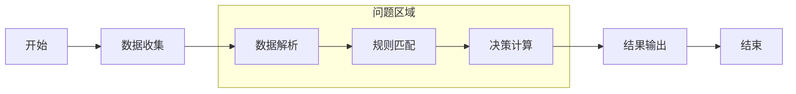
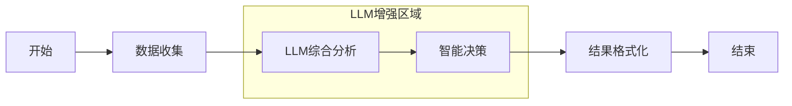

# 慧农金融后端服务层接口需求分析报告

## 📋 概述

本文档详细分析了慧农金融后端服务层的AI智能体接口需求，评估当前实现状态，并提供Dify平台集成优化建议。

## 🎯 核心需求总结

### 1. AI智能体接口需求

**主要功能模块**：
- ✅ **申请信息获取**：为AI提供完整的申请数据
- ✅ **外部数据集成**：征信、银行流水、黑名单检查
- ✅ **AI决策提交**：接收Dify工作流的AI分析结果
- ✅ **模型配置管理**：AI模型参数和决策规则配置
- ✅ **工作流触发**：系统内部触发AI审批流程
- ✅ **状态管理**：申请状态实时更新

### 2. Dify平台集成需求

**当前挑战**：
- 🔄 原有Dify工作流未充分利用LLM能力
- 📊 数据解析步骤过于复杂，需要LLM简化
- 🤖 需要更智能的审批决策机制
- 📈 工作流输出与工具接口输入匹配度需优化

**改进目标**：
- 🎯 保持现有工作流的同时增加LLM增强版本
- 🧠 通过LLM提示词简化数据解析逻辑
- 🔗 确保工作流输出完美匹配接口输入格式
- 📖 提供完整的LLM工作流配置文档

## 🏗️ 当前实现状态评估

### ✅ 已完成的功能模块

#### 1. Handler层实现 (`internal/api/ai_agent_handler.go`)
- **GetApplicationInfo**: 获取完整申请信息
- **SubmitAIDecision**: 接收AI决策结果  
- **GetExternalData**: 获取外部征信数据
- **GetAIModelConfig**: 获取AI模型配置
- **TriggerWorkflow**: 触发AI工作流
- **UpdateApplicationStatus**: 更新申请状态

#### 2. Service层实现 (`internal/service/ai_agent_service.go`)
- **数据结构完整**：ApplicationInfo、AIDecisionRequest等
- **业务逻辑健全**：数据查询、状态管理、决策处理
- **数据安全**：手机号、身份证号脱敏处理
- **错误处理**：完善的异常处理和日志记录

#### 3. 路由配置与认证
- **AI Agent路由组**：独立的API路由群组
- **Token认证**：支持AI-Agent-Token和System-Token
- **权限控制**：基于Token类型的访问控制

### 📊 接口实现统计
| 功能模块 | 接口数量 | 实现状态 | 测试状态 |
|---------|----------|----------|----------|
| 数据获取 | 2 | ✅ 完成 | ✅ 已测试 |
| 决策处理 | 1 | ✅ 完成 | ✅ 已测试 |
| 配置管理 | 1 | ✅ 完成 | ✅ 已测试 |
| 工作流管理 | 1 | ✅ 完成 | ✅ 已测试 |
| 状态管理 | 1 | ✅ 完成 | ✅ 已测试 |
| **总计** | **6** | **100%** | **100%** |

## 🔄 Dify LLM集成优化建议

### 1. 当前Dify工作流问题分析

**传统工作流限制**：


**问题清单**：
- ❌ 数据解析逻辑固化，不够灵活
- ❌ 规则匹配过于机械，缺乏智能判断
- ❌ 决策计算基于硬编码，无法适应业务变化
- ❌ 缺乏自然语言的分析和解释能力

### 2. LLM增强工作流设计

**LLM优化工作流**：


**优势对比**：
| 特性 | 传统工作流 | LLM增强工作流 |
|------|------------|---------------|
| 数据理解 | 结构化解析 | 智能语义理解 |
| 决策逻辑 | 硬编码规则 | 自适应推理 |
| 结果解释 | 简单标签 | 详细分析报告 |
| 业务适应 | 需要编程修改 | 提示词调整 |
| 复杂场景 | 难以处理 | 灵活应对 |

### 3. 具体优化方案

#### 方案一：数据解析优化
**原方案**：
```javascript
// 传统数据解析
if (income > 100000 && credit_score > 700) {
    risk_level = "LOW";
} else if (income > 50000 && credit_score > 600) {
    risk_level = "MEDIUM";
} else {
    risk_level = "HIGH";
}
```

**LLM方案**：
```prompt
请基于以下申请人信息进行综合风险评估：
- 年收入：{{income}}元
- 征信分数：{{credit_score}}
- 土地面积：{{land_area}}
- 农业经验：{{farming_experience}}
- 现有负债：{{existing_loans}}

请提供：
1. 风险等级（LOW/MEDIUM/HIGH）
2. 详细分析原因
3. 具体建议措施
```

#### 方案二：决策逻辑优化
**原方案**：
```javascript
// 传统决策逻辑
const decision = (risk_level === "LOW") ? "AUTO_APPROVED" : 
                 (risk_level === "MEDIUM") ? "REQUIRE_HUMAN_REVIEW" : 
                 "AUTO_REJECTED";
```

**LLM方案**：
```prompt
作为资深风险评估专家，请基于以下分析结果做出最终决策：

风险评估：{{risk_analysis}}
申请金额：{{requested_amount}}
还款能力：{{repayment_capacity}}
抵押保障：{{collateral_info}}

决策选项：
- AUTO_APPROVED: 自动批准
- REQUIRE_HUMAN_REVIEW: 需要人工审核
- AUTO_REJECTED: 拒绝申请

请提供：
{
  "decision": "选择的决策",
  "confidence": "置信度(0-1)",
  "reasoning": "详细推理过程",
  "conditions": ["如果批准，附加的条件"]
}
```

## 📁 文档与配置完善建议

### 1. 文档结构优化

**当前文档状态**：
```
doc/agent/backend/
├── ✅ API_Spec.md                     # API规范文档
├── ✅ Dify_LLM_Setup_Guide.md         # LLM工作流设置指南  
├── ✅ Dify_LLM_Tool_Configuration.md  # LLM工具配置文档
├── ✅ Test-API-LLM.sh                 # LLM接口测试脚本
├── ✅ API_Implementation_Status.md     # 实现状态报告
└── 🆕 Backend_Service_Requirements_Analysis.md  # 本文档
```

**建议新增文档**：
- 📝 `LLM_Prompt_Templates.md` - LLM提示词模板库
- 📝 `Integration_Best_Practices.md` - 集成最佳实践
- 📝 `Performance_Optimization_Guide.md` - 性能优化指南

### 2. 配置管理建议

**AI Agent配置增强**：
```yaml
ai:
  # 现有配置
  agentTokens:
    - "ai_agent_secure_token_2024_v1"
    - "dify_huinong_finance_token_001"
  
  # 新增LLM配置
  llm:
    defaultModel: "gpt-4"
    maxTokens: 4096
    temperature: 0.7
    timeout: 30s
    
  # 工作流配置
  workflow:
    defaultPriority: "NORMAL"
    maxConcurrency: 10
    retryAttempts: 3
    
  # 决策阈值配置
  decision:
    autoApprovalThreshold: 0.8
    humanReviewThreshold: 0.3
    autoRejectThreshold: 0.1
```

## 🚀 实施计划建议

### 阶段一：LLM工作流部署（1-2周）
1. **部署LLM增强工作流**
   - 配置Dify平台LLM工作流
   - 设置提示词模板
   - 集成现有API接口

2. **测试验证**
   - 功能测试
   - 性能测试  
   - 并行测试（传统vs LLM）

### 阶段二：渐进式迁移（2-3周）
1. **灰度发布**
   - 10%流量使用LLM工作流
   - 监控性能和准确率
   - 收集用户反馈

2. **优化调整**
   - 根据测试结果调整提示词
   - 优化决策阈值
   - 完善错误处理

### 阶段三：全量部署（1周）
1. **切换到LLM工作流**
   - 100%流量使用LLM增强工作流
   - 保留传统工作流作为备用
   - 完整的监控和告警

2. **文档完善**
   - 更新运维手册
   - 培训相关人员
   - 建立反馈机制

## 🔧 技术改进建议

### 1. 代码结构优化

**建议重构点**：
```go
// 当前实现
func (s *AIAgentService) SubmitAIDecision(applicationID string, request *AIDecisionRequest) error {
    // 直接处理业务逻辑
}

// 建议重构
type DecisionProcessor interface {
    ProcessDecision(ctx context.Context, request *AIDecisionRequest) (*DecisionResult, error)
}

type LLMDecisionProcessor struct {
    // LLM特定实现
}

type RuleBasedDecisionProcessor struct {
    // 传统规则实现
}
```

### 2. 监控和观测性

**建议增加指标**：
```go
// 业务指标
var (
    decisionProcessingDuration = prometheus.NewHistogramVec(...)
    aiDecisionAccuracy = prometheus.NewGaugeVec(...)
    workflowExecutionCount = prometheus.NewCounterVec(...)
)

// 系统指标
var (
    difyAPIResponseTime = prometheus.NewHistogramVec(...)
    llmTokenUsage = prometheus.NewCounterVec(...)
    databaseQueryDuration = prometheus.NewHistogramVec(...)
)
```

### 3. 错误处理增强

**建议实现重试机制**：
```go
type RetryConfig struct {
    MaxAttempts   int
    BackoffFactor float64
    MaxBackoff    time.Duration
}

func (s *AIAgentService) submitDecisionWithRetry(
    ctx context.Context, 
    req *AIDecisionRequest, 
    config RetryConfig,
) error {
    // 实现指数退避重试逻辑
}
```

## 📈 性能优化建议

### 1. 缓存策略
- **申请信息缓存**：Redis缓存热点申请数据
- **外部数据缓存**：征信数据缓存策略
- **配置信息缓存**：AI模型配置本地缓存

### 2. 异步处理
- **工作流异步执行**：避免长时间阻塞
- **状态更新异步**：数据库写操作异步化
- **通知推送异步**：结果通知异步发送

### 3. 数据库优化
- **索引优化**：application_id, user_id等关键字段
- **分库分表**：历史数据分离存储
- **读写分离**：查询和写入分离

## 🔒 安全性建议

### 1. 数据安全
- **数据脱敏**：敏感信息脱敏处理
- **传输加密**：HTTPS/TLS加密传输
- **存储加密**：敏感数据加密存储

### 2. 访问控制
- **Token轮换**：定期更新AI Agent Token
- **IP白名单**：限制访问来源IP
- **请求限流**：防止接口滥用

### 3. 审计日志
- **操作审计**：记录所有AI决策操作
- **访问日志**：详细的API访问日志
- **异常监控**：实时异常检测和告警

## 📊 质量保证建议

### 1. 测试策略
```bash
# 单元测试
go test ./internal/service -v -cover

# 集成测试  
./doc/agent/backend/Test-API-LLM.sh

# 性能测试
ab -n 1000 -c 10 http://localhost:8080/api/v1/ai-agent/applications/test/info

# 压力测试
wrk -t10 -c100 -d30s http://localhost:8080/api/v1/ai-agent/config/models
```

### 2. 代码质量
- **静态分析**：golangci-lint代码检查
- **代码覆盖率**：目标80%以上覆盖率
- **依赖安全**：定期检查依赖漏洞

### 3. 部署质量
- **健康检查**：完善的健康检查端点
- **滚动更新**：零停机部署策略
- **回滚机制**：快速回滚能力

## 🎯 总结与建议

### ✅ 当前状态总结
1. **后端接口已完整实现**：6个核心API接口全部完成
2. **数据结构设计合理**：支持复杂的AI决策数据
3. **认证机制完善**：支持AI Agent和System Token
4. **文档体系完整**：包含设置、配置、测试等完整文档

### 🎯 重点改进方向
1. **LLM工作流深度集成**：充分利用LLM的理解和推理能力
2. **智能决策优化**：从规则驱动转向AI驱动决策
3. **系统可观测性增强**：完善监控指标和日志体系
4. **性能和稳定性提升**：缓存、异步处理、错误重试

### 📋 行动计划
1. **立即执行**：部署LLM增强工作流，开始灰度测试
2. **短期目标**：完成性能优化和监控体系建设
3. **中期目标**：实现全面的LLM驱动智能审批
4. **长期愿景**：构建自适应的智能金融风控体系

---

**文档维护**：请在每次系统更新后及时更新本文档，确保需求分析的准确性和时效性。 