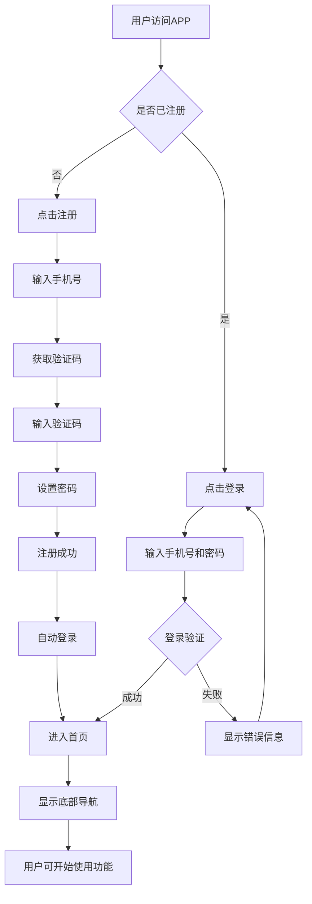
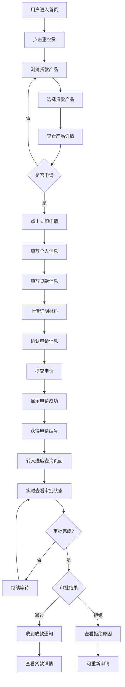
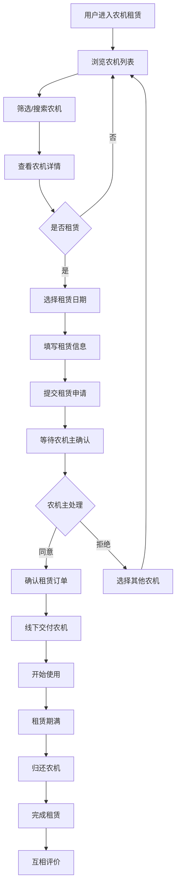
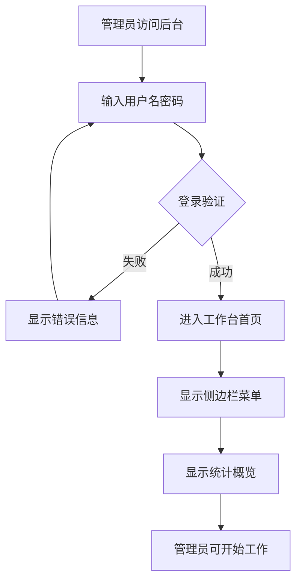
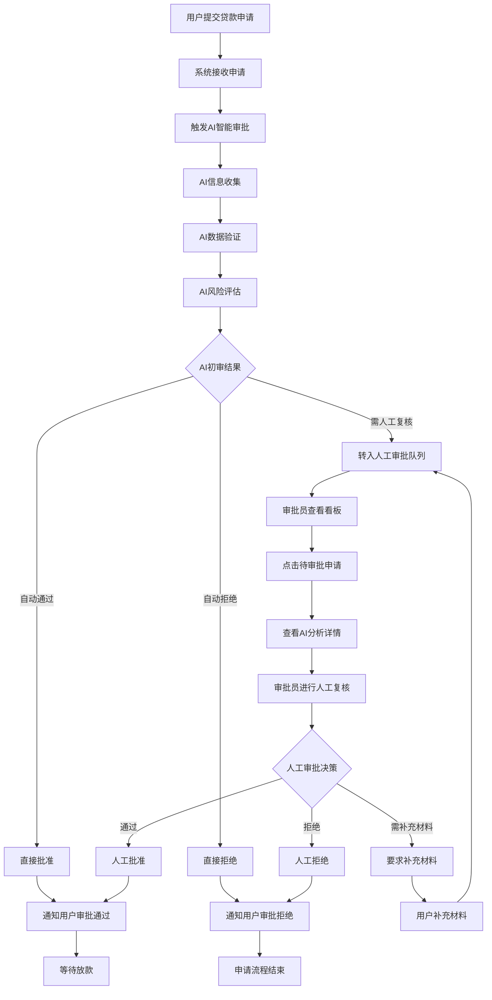
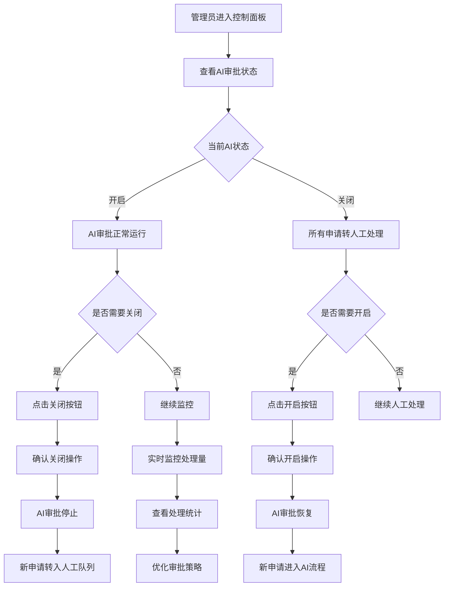
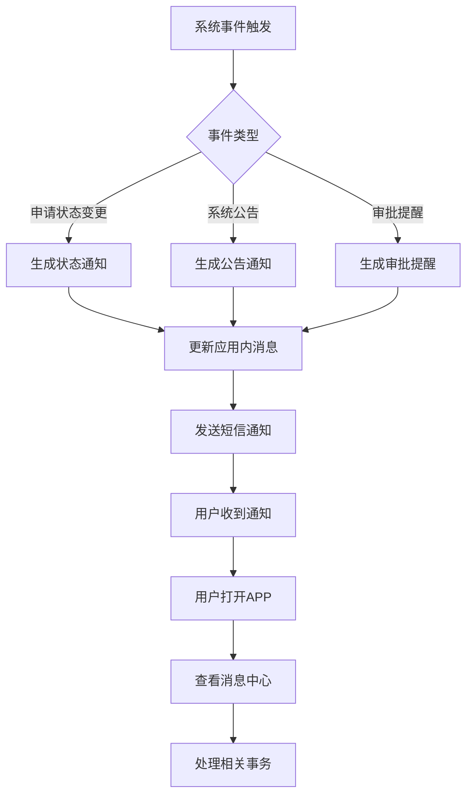
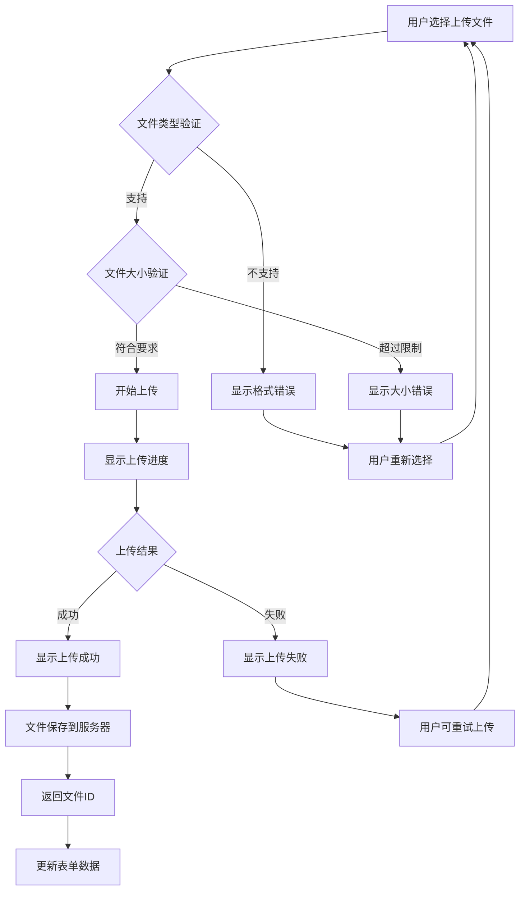
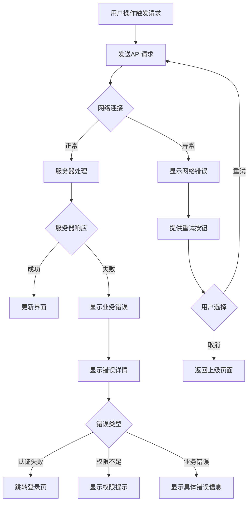
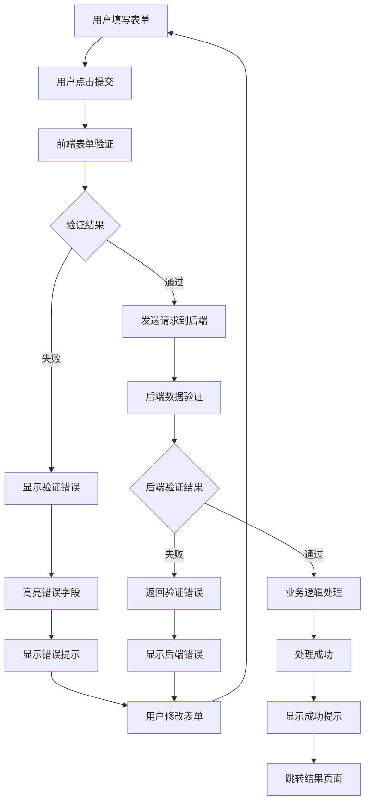

# 数字惠农应用 - 用户操作流程图

## 1. 概述

本文档描述数字惠农APP及OA后台管理系统的核心用户操作流程，通过流程图的形式展示用户从进入系统到完成核心任务的完整路径。

## 2. 用户端核心流程

### 2.1 用户注册登录流程

### 2.2 惠农贷申请流程

### 2.3 农机租赁流程

## 3. 管理端核心流程

### 3.1 管理员登录流程

### 3.2 贷款审批流程

### 3.3 AI审批控制流程

## 4. 用户与系统交互流程

### 4.1 消息通知流程

### 4.2 文件上传流程

## 5. 异常处理流程

### 5.1 网络异常处理

### 5.2 表单验证流程

这些流程图清晰地展示了用户在使用数字惠农APP和OA后台管理系统时的操作路径，有助于开发团队理解用户需求和系统逻辑。

---

**文档版本**：v1.0  
**更新时间**：2024-03-12  
**维护人员**：UI/UX设计团队 