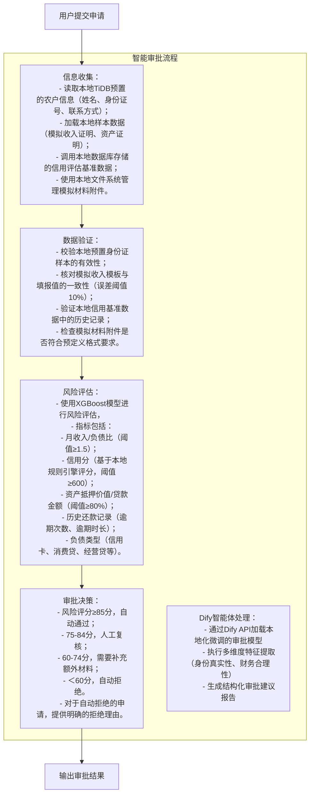

# 数字惠农APP及OA后台管理系统产品需求文档

## 功能名：数字惠农APP开发及OA后台管理系统集成

### 需求描述：
开发基于Golang后端、Vue3前端的数字惠农APP（含用户App、网页端），并构建包含智能体与MCP工具集成的OA后台管理系统，实现银行工作人员对用户申请的自动审批功能。

### 功能需求：
1. **用户App/网页端**：
   - 首页：展示惠农政策公告、服务入口（如贷款申请、补贴申领）；
   - 申请页：包含个人信息（姓名、身份证号、联系方式）、财务信息（收入证明、资产情况）、信用授权等输入表单；
   - 进度查询页：展示申请状态（待审核、已通过、被拒绝）及审批意见。
2. **OA后台管理系统**：
   - 审批看板：实时显示待处理申请列表、各环节处理进度；
   - 智能审批详情页：展示智能体各环节处理结果（信息收集明细、数据验证报告、风险评估得分）及最终审批结论。

### 技术栈：
- **后端**：Golang
- **前端**：Vue3
- **数据库**：TiDB（已本地部署）
- **AI开发平台**：Dify（已本地部署）
- **MCP工具**：MCP数据库查询，MCP审批决策。

### 概述：
本项目采用本地化部署方案，基于TiDB分布式数据库和Dify AI开发平台构建私有化运行环境。通过Dify实现大语言模型本地化微调和智能体编排，结合MCP工具链完成全流程自动化审批。用户App与网页端提供惠农政策展示及模拟申请功能；OA后台管理系统集成智能审批流程，通过本地数据源完成演示用农户信息的采集验证、风险评估及自动审批，实现完整的业务流程闭环演示。

## 功能流程演示：

首先使用用户角色通过App/网页进入服务申请页，填写个人、财务信息并提交。

再使用系统管理员身份进入系统查看自动审批流程，此时为了保证自动审批不是瞬时触发完成，需要增加“开启/关闭智能审批按钮”来控制OA后台的智能审批。

开启后自动触发OA后台的智能审批流程，包括信息收集、数据验证、风险评估和审批决策等环节。

用户通过进度查询页查看审批状态，若通过则接收通知；若拒绝则查看具体原因。

### 相关页面设计：
1. **用户App/网页端**：
   - 登录页：用户输入账号、密码登录；
   
   - 首页：惠农政策公告、服务入口（如贷款申请、补贴申领）；
   
   - 理财页：
   
   - 我的页：
   
   - 农机租赁页：
   暂无，需自行设计
   - 租赁申请页：包含个人信息（姓名、身份证号、联系方式）、财务信息（收入证明、资产情况）、信用授权等输入表单；
   
   - 进度查询页：展示申请状态（待审核、已通过、被拒绝）及审批意见。
2. **OA后台管理系统**：
   - 经典OA系统页面
   
   - 审批看板：实时显示待处理申请列表、各环节处理进度；
   - 智能审批详情页：展示智能体各环节处理结果（信息收集明细、数据验证报告、风险评估得分）及最终审批结论。

### 用户旅程：
1. 用户通过App/网页进入服务申请页，填写个人、财务信息并提交；
2. 系统自动触发OA后台的智能审批流程；
3. 用户通过进度查询页查看审批状态，若通过则接收通知；若拒绝则查看具体原因。

### 用户故事：
作为种植户，我希望通过手机App快速提交农业贷款申请，系统能通过AI智能体自动分析我的信用画像和财务健康度，实时生成风险评估报告，避免多次跑银行提交材料，并能通过自然语言对话方式查询审批进度。

### 实现逻辑：

### 功能细节描述：

- **信息收集**：
  - 读取本地TiDB预置的农户信息（姓名加密随机、身份证号加密随机、联系方式加密随机）；
  - 加载本地样本数据（模拟收入证明、资产证明）；
  - 调用本地数据库存储的信用评估基准数据；
  - 使用本地文件系统管理模拟材料附件。
  - 基于本地TiDB集群构建模拟数据仓库，预置100+农户样本数据（含身份信息、财务模板、信用基准），支持演示时动态加载不同风险等级的申请模板。数据更新通过本地SQL脚本批量导  
    入，支持手动重置为初始状态。

- **智能体训练**：
  - 基于Dify平台，使用本地数据集进行微调，提高模型的准确性和泛化能力；
  - 模型训练数据包括：
    <!-- - 1000+农户样本数据（含身份信息、财务模板、信用基准）； -->
    <!-- - 1000+人工审核通过的申请样本（含审批结论）； -->
    <!-- - 1000+人工审核拒绝的申请样本（含拒绝理由）。 -->
  - 模型训练过程中，采用了多维度特征提取，包括身份真实性、财务合理性等。
  - 模型训练完成后，Dify将模型部署到本地环境，实现智能体的本地化运行。

- **数据验证**：
  - 基于本地数据源，实现对身份证样本的有效性校验；
  - 核对模拟收入模板与填报值的一致性（误差阈值10%）；
  - 验证本地信用基准数据中的历史记录；
  - 检查模拟材料附件是否符合预定义格式要求。

- **风险评估**：
  - 使用XGBoost模型进行风险评估，
  - 指标包括：
    - 月收入/负债比（阈值≥1.5）；
    - 资产抵押价值/贷款金额（阈值≥80%）；
    - 历史还款记录（逾期次数、逾期时长）；
    - 负债类型（信用卡、消费贷、经营贷等）。
  - 风险评估结果包含总风险评分以及各指标的详细得分明细，并计算出信用分。

- **审批决策**：
  - 风险评分≥85分，自动通过；
  - 75-84分，自动转入人工复核；
  - 60-74分，需要补充额外材料；
  - ＜60分，自动拒绝。
  - 对于自动拒绝的申请，提供明确的拒绝理由。

- **人工复核**：
  - 对于需要人工复核的申请，系统自动分配至对应区域的银行信贷专员，并要求在24小时内完成。
  - 人工复核过程中，银行信贷专员可以通过App或网页端查看申请详情，并进行审批决策。
  - 审批结果实时推送至用户App，用户可以通过进度查询页查看审批状态。

- **数据管理**：
  - 系统通过本地数据库存储和管理农户信息、财务模板、信用基准数据，确保数据的安全性和完整性。    
  - 系统支持数据的权限管理，便于数据的访问控制。
  - 系统支持数据的加密和解密，便于数据的安全性。
  - 系统支持数据的统计和分析，便于数据的统计和分析。
  - 系统支持数据的可视化，便于数据的可视化。