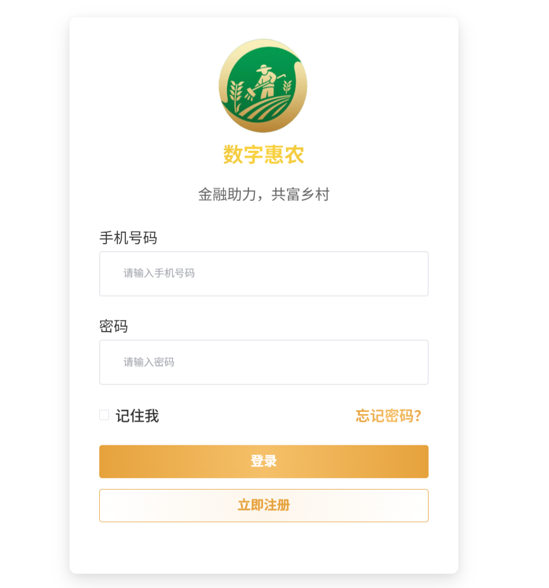
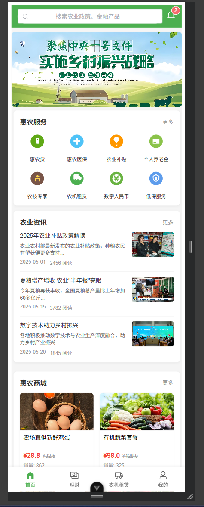
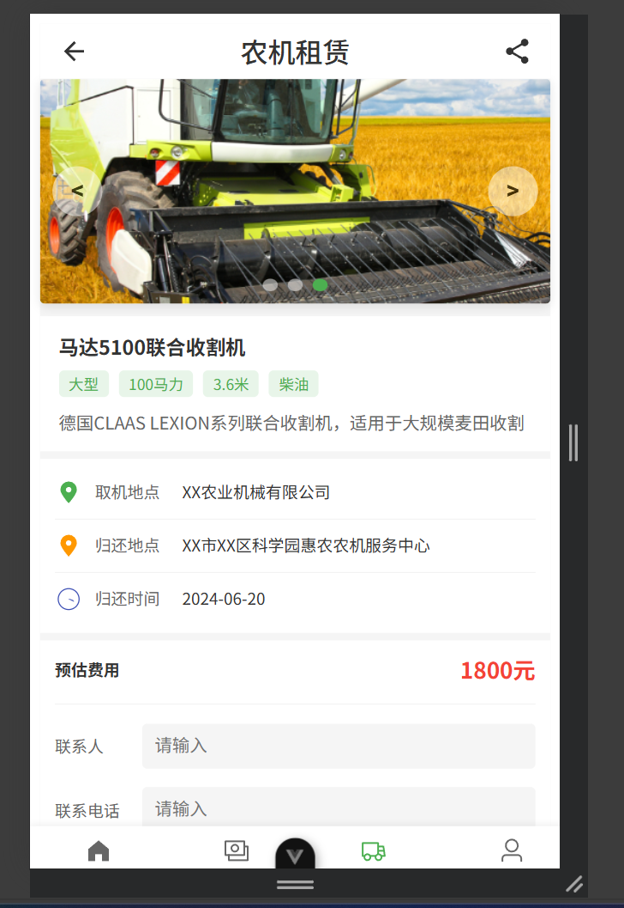
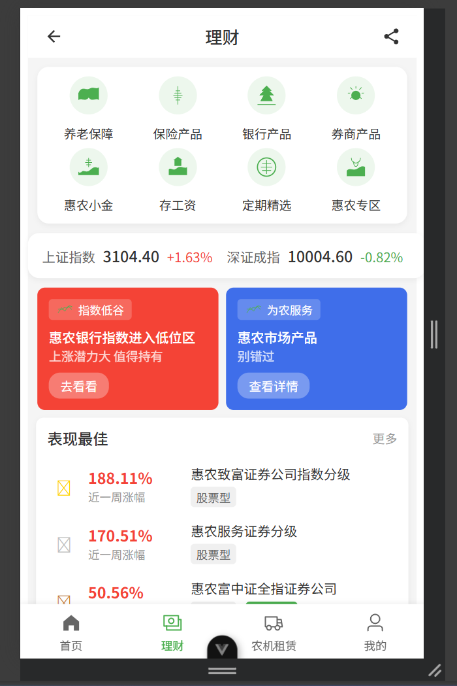
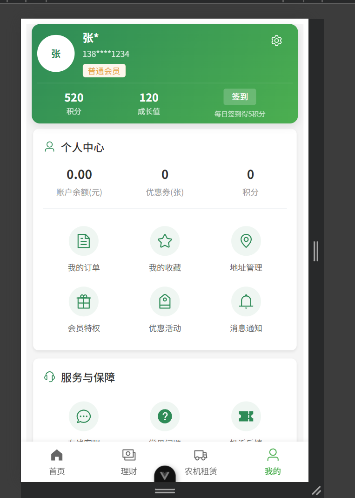
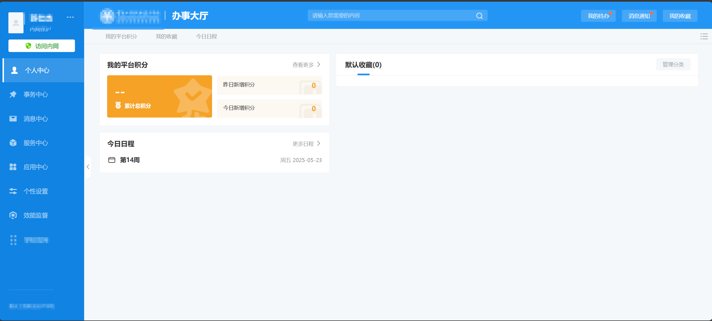

### 数字惠农APP及OA后台管理系统产品需求文档

## 功能名：数字惠农APP开发及OA后台管理系统集成

### 需求描述：
本项目旨在开发一款基于Golang后端和Vue3前端技术栈的数字惠农应用程序（包括移动应用和网页版本），并构建一个包含智能体与MCP工具集成的OA后台管理系统，以实现银行工作人员对用户申请的自动审批功能。系统将采用本地化部署方案，利用TiDB分布式数据库和Dify AI开发平台来创建私有化的运行环境，通过Dify实现大语言模型本地化微调和智能体编排，并结合MCP工具链完成全流程自动化审批。

### 功能需求：

#### 用户App/网页端
- **登录页**：支持用户账号密码登录。
  
- **首页**：展示最新的惠农政策公告、服务入口等信息。
  - 包含以下主要功能：
  - 展示惠农政策公告，包括政策标题、发布日期、内容等。
  - 提供服务入口，包括贷款申请、补贴申领等。
  - 提供贷款申请、补贴申领等服务链接。
  
- **农机租赁页**：
  - 提供农机租赁服务，用户可以查看选择租赁车辆并进入相关信息页面。
  - 包含以下主要功能：
  - 展示可用的农机租赁车辆列表，包括车辆名称、价格、描述等信息。
  - 提供选择租赁车辆的选项，用户可以根据需求选择心仪的车辆。
- **申请页**：收集用户的个人信息（姓名、身份证号、联系方式）、财务状况（收入证明、资产情况）以及信用授权等信息。
  
- **进度查询页**：允许用户查看其提交的各种申请的状态更新（待审核、已批准、被拒绝）及相应的反馈意见。
  - 包含以下主要功能：
  - 展示用户提交的申请列表，包括申请的类型、状态、提交日期等信息。
  - 提供每个申请的详细状态查询功能，包括审批进度、审批意见等。
  - 提供用户反馈功能，用户可以对已提交的申请进行反馈或提出问题。
  - 提供用户联系客服功能，用户可以通过客服电话或在线聊天与客服进行联系。
- **其他页面**：理财页、我的页等。
  
  

#### OA后台管理系统
- **登录页**：支持系统管理员账号密码登录。
- **首页**：展示系统的主要功能菜单和统计数据。
  - 包含以下主要功能：
  - 展示系统的主要功能菜单，包括审批看板、智能审批详情页等。
  - 提供统计数据，包括待处理申请数量、已处理申请数量等。
  
- **审批看板**：提供实时待处理申请列表视图，显示每项申请在不同阶段的进展情况。
- **智能审批详情页**：展示由AI驱动的各个审批环节的结果概览，如信息收集报告、数据验证结果、风险评估得分及其最终决定。
- **控制面板**：具备开启或关闭智能审批流程的功能按钮，以便于测试和演示目的下的人工干预。

### 技术栈：
- **后端编程语言**：Golang
- **前端框架**：Vue3
- **数据库解决方案**：TiDB（存储持久化业务数据，如用户基本信息、历史申请记录等）
- **缓存/状态存储**：Redis（用于存储用户会话状态、临时申请数据等高频访问的临时状态，提升系统响应效率）
- **人工智能平台**：Dify
- **中间件组件**：MCP工具用于数据库查询和审批决策辅助（在演示中需要体现MCP先进协议）

### 概述：
此项目将围绕着为农村用户提供便捷金融服务这一核心目标展开，通过构建一个高效、安全且易于使用的数字化平台，简化传统金融服务中的繁琐步骤，提高效率的同时也增强了用户体验。此外，借助先进的AI技术和大数据分析能力，能够更准确地评估风险，从而做出更加合理的信贷决策。

### 相关页面设计：
请参考附件中的设计稿图片，对于未列出的设计元素，请根据实际业务需求进行补充设计。

## 功能流程演示：
首先使用用户角色通过App/网页进入服务申请页，填写个人、财务信息并提交。
再使用系统管理员身份进入系统查看自动审批流程，此时为了保证自动审批不是瞬时触发完成，需要增加“开启/关闭智能审批按钮”来控制OA后台的智能审批。
开启后自动触发OA后台的智能审批流程，包括信息收集、数据验证、风险评估和审批决策等环节。
用户通过进度查询页查看审批状态，若通过则接收通知；若拒绝则查看具体原因。

### 用户旅程：
1. 用户注册并登录到应用中；
2. 浏览首页获取最新资讯和服务选项；
3. 选择所需的服务类型（例如贷款申请），填写相关表格；
4. 提交表单后等待审批结果；
5. 可随时访问进度查询页了解当前状态；
6. 收到通知后确认是否获得批准。

### 实现逻辑：

### 功能细节描述：

- **信息收集**：
  - 从TiDB读取加密后的农户基本信息；
  - 根据预设模板加载模拟财务文件；
  - 调用数据库内的信用评分标准；
  - 利用本地文件系统管理上传的证明材料。

- **智能体训练**：
  - 在Dify平台上使用定制化数据集训练专用模型；
  - 训练集涵盖正面案例（成功获批）和负面案例（被拒理由）；
  - 模型侧重于身份验证、经济状况评价等方面的能力提升；
  - 完成后将其部署至本地服务器上执行预测任务。

- **数据验证**：
  - 对身份证号码进行有效性检查；
  - 确认提供的收入证明与数据库记录相符；
  - 审核历史信用表现；
  - 检查上传文件格式是否正确。

- **风险评估**：
  - 应用XGBoost算法计算综合风险分数；
  - 分析多个维度的数据点，比如偿债能力、资产质量等；
  - 生成详细的评估报告供进一步审查。

- **审批决策**：
  - 根据风险等级自动作出初步判断；
  - 达到特定阈值时直接通过或拒绝；
  - 处于灰色地带的情况则需人工介入复审；
  - 明确告知申请人具体的评审依据。

- **人工复核**：
  - 将复杂案件分配给专业的信贷分析师；
  - 设置时间限制确保及时处理；
  - 提供在线界面方便专家查阅资料；
  - 更新系统记录并将结果反馈给客户。

- **用户状态管理**：
  - 使用Redis存储用户会话令牌、待审批的临时申请数据（如未提交的表单草稿、审批过程中的中间状态）等高频访问的临时状态，设置合理的缓存过期时间（如30分钟）以避免内存泄漏；
  - 后端需新增状态读写接口（如`GET /user/status/{userId}`和`PUT /user/status/{userId}`），实现对Redis的直接操作；
  - 与TiDB的分工：TiDB负责存储用户身份信息、历史申请记录等持久化数据，Redis负责存储当前会话及审批流程中的临时状态，两者通过唯一用户ID进行关联同步。

- **数据管理**：
  - 采用严格的安全措施保护敏感信息；
  - 实施细粒度的角色权限控制机制；
  - 引入加密算法增强隐私保护；
  - 提供丰富的报表工具支持数据分析；
  - 开发可视化仪表盘便于监控运营指标。

---

以上是针对“数字惠农APP及OA后台管理系统”的详细产品需求文档概述。希望这份文档能够帮助团队成员更好地理解项目背景、明确各自职责分工，并为后续开发工作奠定坚实的基础。如果有任何疑问或者需要进一步讨论的地方，请随时提出。